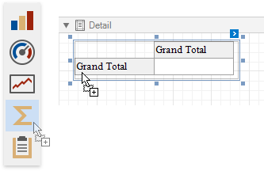

# Link a Chart and a Pivot Grid

This tutorial demonstrates how to use the Chart control to visualize the Pivot Grid control's data.

## Create a Pivot Grid

1. Drop the **Pivot Grid** control from the [Toolbox](../../report-designer-tools/toolbox.md) onto the [Detail band](../../introduction-to-banded-reports.md).

    

2. Open the [Toolbar](../../report-designer-tools/toolbar.md)'s **Pivot Grid Tools** contextual tab and click **Add Data Source** to bind the pivot grid to data.

    

3. Navigate through the invoked [Data Source Wizard](../../report-designer-tools/data-source-wizard.md)'s pages to set up the data source. See the [Bind to Data](../../bind-to-data.md) section for more information.

    After the data source is created, the Pivot Grid's **Data Source** and **Data Member** properties are assigned automatically.

4.  Switch the **Pivot Grid Tools** toolbar tab and click **Run Designer**. In the invoked Designer, click **Retrieve Fields**  to obtain fields from the control's data source.

    

5. Switch to the **Layout** page and drag-and-drop the data fields onto the **Row Fields**, **Column Fields** and **Data Items** areas to define the Pivot Grid's layout.

    

    Click **Apply** and close the Designer.

## Link a Chart with the Pivot grid

1.  Drop the **Chart** control from the [Toolbox](../../report-designer-tools/toolbox.md) onto the Detail band below the Pivot Grid.

    

2. The **Chart Designer** is invoked automatically after you drop the Chart onto the Detail band. Switch to the **Data** tab at the right of the Designer's window and choose the Pivot Grid in the drop-down list.

    

    This adjusts all the Chart's binding and layout settings autmatically. Make sure that **Series**, **Argument** and **Value** cells are filled with the corresponding fields. Note that field values are generated based on the Pivot Grid's columns, rows, and data items.

    

3. Select the **Label** node under auto-generated series in the chart elements tree and switch to the **Options** tab. Disable the **Visibility** check box to avoid overlapping series labels.

    

4. (optionally) You can customize various settings that determine a linked Chart and Pivot Grid pair's common behavior. To do this, use the Chart's **Pivot Grid Data Source Options** property. This property is synchronized with the Pivot Grid's **Options Chart Data Source** property.

    

## View the Result

Switch to [Print Preview](../../preview-print-and-export-reports.md) to see the resulting report.

