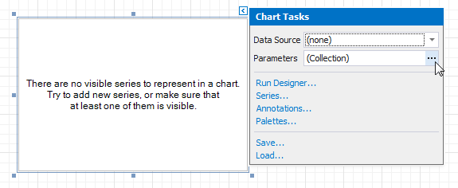
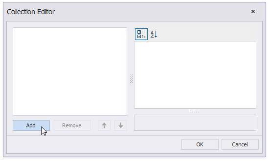
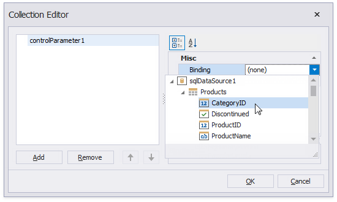

# Use Charts to Visualize Data in Report Groups

This tutorial describes how to use charts to visualize data in each report group.

## Group Report Data

Do the following to group data in a report:

1. [Bind the report](../../bind-to-data.md) to a database table (for instance, **Products**).

1. Drop the **ProductName** field from the [Field List](../../report-designer-tools/ui-panels/field-list.md) onto the report's Detail band.

	

1. Click **Add a Group** in the [Group and Sort](../../report-designer-tools/ui-panels/group-and-sort-panel.md) panel and select group criteria (for example, the **CategoryID** field).

	

1. Enable the **Show Footer** check box to add a Group Footer to the report.

	

1. Drop the **CategoryID** field onto the Group Header to display group titles in the report.

	

## Create a Chart

Do the following to add a chart to the report:

1. Drop the **Chart** control from the [Toolbox](../../report-designer-tools/toolbox.md) onto the Group Footer.

	

    Close the Chart Designer if it is invoked.

1. Click the chart's smart tag. Click the **Parameters** property's ellipsis button.

	

1. Click **Add** in the invoked editor. This creates a new chart parameter.

	

1. Expand the **Binding** drop-down list and select a data field.

	

	Click **OK** to close the editor.

1. Open the [Toolbar](../../report-designer-tools/toolbar.md)'s **Chart Tools** contextual tab and click the **Run Designer** button.

	

1. Click the plus button next to the **Series** item in the **Chart Designer** to add a new series.

	

	Select a series view type.

	

1. Switch to the created series' **Data** tab.
	
	Drop the **ProductName** field onto the Argument area and the **UnitPrice** field onto the Value area.
	
	

1. Switch to the **Properties** tab. Click the **Filter String** property's ellipsis button. Construct filter criteria in the invoked FilterString Editor and click OK.
	
	

	Click **OK** to close the **Chart Designer** window.

Switch to [Print Preview](../../preview-print-and-export-reports.md) to see the resulting report.

