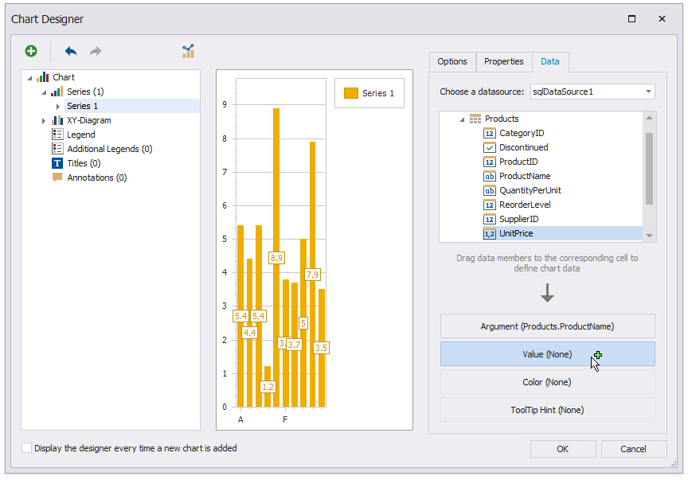

# Use Charts to Visualize Data in Report Groups

This tutorial describes how to use charts to visualize data in each report group. 

## Group Report Data
Do the following to group data in a report:

* [Bind the report](../../bind-to-data.md) to the required database table (for instance, **Products**).

* Drop the **ProductName** field from the [Field List](../../report-designer-tools/ui-panels/field-list.md) onto the report's Detail band.
	
	

* In the [Group and Sort](../../report-designer-tools/ui-panels/group-and-sort-panel.md) panel, click **Add a Group** and select group criteria (for example, the **CategoryID** field).
	
	

* Enable the **Show Footer** check box to add a Group Footer to the report.
	
	
    
* Drop the **Category ID** field onto the Group Header to display group titles in the report.
	
	

## Create a Chart
Do the following to add a chart to the report:

* Drop the **Chart** control from the [Toolbox](../../report-designer-tools/toolbox.md) onto the Group Footer.
	
	

    The Chart Designer is invoked. If it is not, open the [Toolbar](../../report-designer-tools/toolbar.md)'s **Chart Tools** contextual tab and click the **Run Designer** button.
	
	
   
* In the Chart Designer, click the plus button to add a new series and select a series view (for example, **Bar**).
	
	

* Select the created series and switch to the **Data** tab.
	
	On this tab, drop the **Product Name** field onto the **Argument** area and the **Unit Price** field onto the **Value** area.
	
	

* Switch to the **Properties** tab and click the **Data Filters** property's ellipsis button.
	
	

* In the **Data Filter Collection Editor**, click **Add** to create a new filter.
	
	Set the filter's **Column Name** and **Value Binding** properties to the **CategoryID** field that is used as group criteria in the report.
	
	
	
	Only the **Value Binding** setting is taken into account when the **Value** and **Value Binding** properties are specified for a data filter.

Switch to [Print Preview](../../preview-print-and-export-reports.md) to see the resulting report.