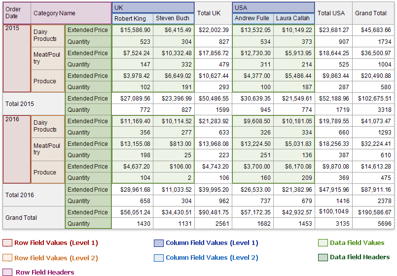

# Use Cross Tabs

The Cross Tab control displays data in rows and columns. You can specify what data to use as row/column headers, and what data should be shown in row and column intersections. You can also determine how to group, sort, format and lay out data.

Refer to the following topics for instructions on how to use cross tabs in reports:

* [Cross Tab Overview](use-cross-tabs/cross-tab-overview.md)

    Explains how to add a Cross Tab to a report and bind a Cross Tab to data.

* [Cross Tab Fields](use-cross-tabs/cross-tab-fields.md)

    Describes the Cross Tab row fields, column fields, data fields, and how to format field values.

* [Cross Tab Settings](use-cross-tabs/cross-tab-settings.md)

    Demonstrates how to group, sort and filter Cross Tab data and hide specific cells.

* [Layout Options](use-cross-tabs/layout-options.md)

    Shows how to adjust control size, change header text, and customize the control's appearance.