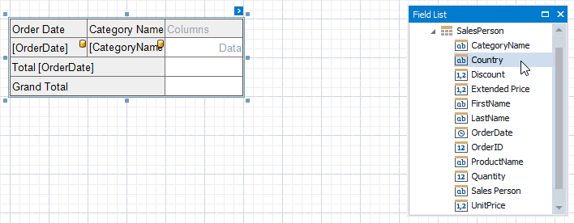
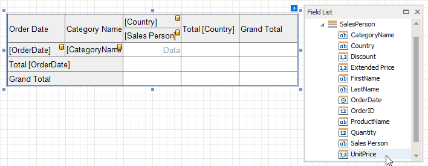
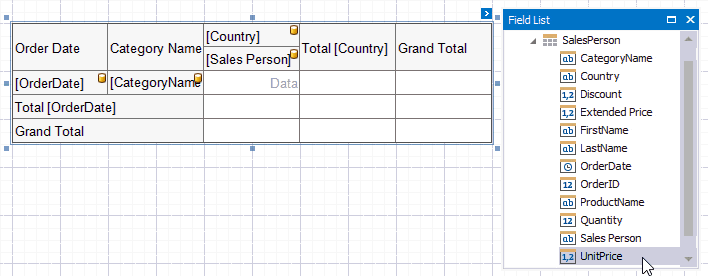
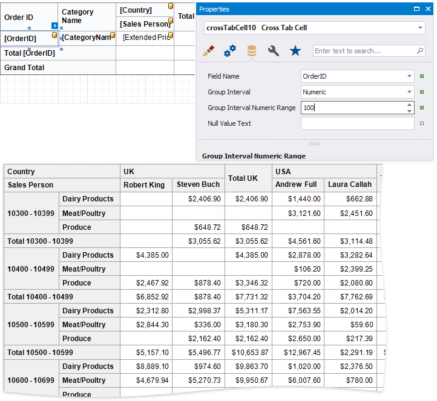
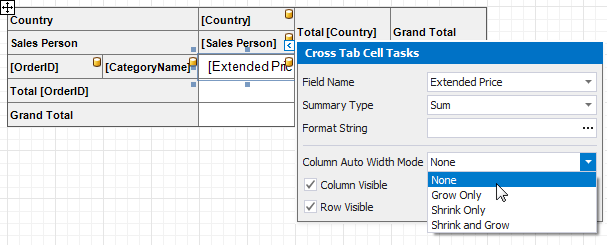
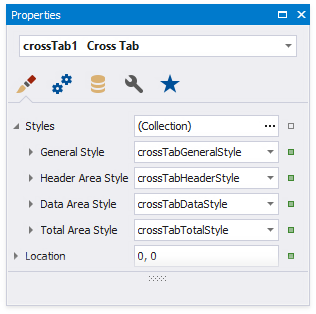
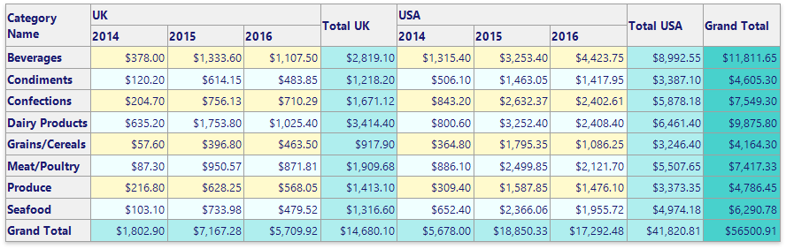

# Use Cross Tabs

Use the **Cross Tab** control to display multi-dimensional data, such as summary statistics, surveys, market research information, etc.

The following step-by-step tutorials describe how to add this control to a report:

* [Create a Cross-Tab Report](../create-popular-reports/create-a-cross-tab-report.md) - Shows how to use the [Cross-Tab Report Wizard](../report-designer-tools/report-wizard/cross-tab-report-wizard.md).
* [Create a Balance Sheet](../create-popular-reports/create-a-balance-sheet.md) - Demonstrates how to configure a Cross Tab on the design surface.

## Add a Cross Tab to a Report

Drag the **Cross Tab** item from the Toolbox onto a report.

You cannot place the Cross Tab in another report control ([Table Cell](use-tables.md) or [Panel](use-basic-report-controls/panel.md)) because its width cannot be determined at design time.

## Bind to Data

Use the Cross Tab's **Data Source** and **Data Member** properties to bind this control to data.

1. Click the Cross Tab's smart tag.
2. Expand the **Data Source** property's drop-down list and click **Add Report Data Source**.
3. Follow the steps in the invoked [Data Source Wizard](../report-designer-tools/data-source-wizard.md) to configure a data source.

If these properties are not set, the Cross Tab uses its parent report's data source (the report's **Data Source** and **Data Member** properties).

> [!Note]
> If you place a Cross Tab in the [Detail band](../introduction-to-banded-reports.md), ensure that the report's **Data Source** property is not set. Otherwise, the Cross Tab data is printed as many times as there are rows in the report data source.

## Define Cross Tab Fields

Drop data fields from the [Field List](../report-designer-tools/ui-panels/field-list.md) onto cross-tab areas to define the control layout. The Cross Tab supports three field types (areas):

* **Rows** (the **Row Fields** collection) - displays field values as row headers.

* **Columns** (the **Column Fields** collection) - displays field values as column headers.

* **Data** (the **Data Fields** collection) - uses field values to calculate summaries at row and column intersections.

> [!Tip]
> You can also use [calculated fields](../shape-report-data/use-calculated-fields.md) if data source fields do not suit your requirements and you need to pre-process data before it is shown in the Cross Tab.

### Row and Column Fields

You can drop two or more data fields onto the same area to create a hierarchy. The first field's values are displayed at the root level (the first column/row), the second field's values are grouped by the first field's values and displayed at the second hierarchy level (the second column/row), and so on.

* **Specify Row Fields**

  

* **Specify Column Fields**

  

Cross Tab cells marked with a database icon become bound to the dropped fields. The corresponding rows/columns are printed in the document as many times as there are field values in the data source. The top left corner displays headers for row data fields. 

Additional rows/columns are added to the Cross Tab to display total values calculated against these fields. The last row/column displays grand total values calculated against all the rows/columns.

### Data Fields

You can add two or more data fields and arrange them in two ways:

* in a column, one under the other (field headers are displayed as row headers);

  

* in a row, one after the other (field headers are displayed as column headers);

   

When the data area contains only one field, the field header is not displayed.

### Specifics

The following specifics apply when you design the Cross Tab layout:

* You cannot bind the top left corner, row/column totals, and row/column grand totals;
* You cannot bind Cross Tab cells to [report parameters](../shape-report-data/use-report-parameters.md);
* You can only bind Cross Tab cells to fields from a data source and data member assigned to the **Data Source** and **Data Member** properties.

### Format Field Values

Use a cell's **Text Format String** property to format output data.

You can also use the **Null Value Text** property to specify the text shown when a data field's value is null or empty.  

### Preview

Switch to Print Preview to see the Cross Tab populated with data. The following image illustrates Cross Tab elements:

## Use the Cross-Tab Wizard

You can also use the [Cross-Tab Report Wizard](../report-designer-tools/report-wizard/cross-tab-report-wizard.md) to create a new cross-tab report based on a template.

## Calculate Totals

The Cross Tab calculates the following automatic totals:

* **Row Totals** - against outer row fields;
* **Row Grand Totals** - against all the rows;
* **Column Totals** - against outer column fields;
* **Column Grand Totals** - against all the columns.

You can use the [layout options](#layout-options) to move rows and columns that display total values.

If you want to [hide specific totals](#hide-specific-rows-and-columns), select any cell in the row/column and disable the **Row Visible**/**Column Visible** property.

## Change the Summary Type

The Cross Tab summarizes values of [data fields](#data-fields) and displays the results "as is" at the intersection of the corresponding rows and columns.

Use the **Summary Type** property to specify the summary function calculated against a data field.

Use the [SummaryDisplayType](xref:DevExpress.XtraReports.UI.CrossTab.CrossTabDataField.SummaryDisplayType) property to display results' contribution to other cell values, for example, as a percentage of grand total values.

## Sort Data

The Cross Tab displays row and column field values in the ascending order. Use the **Sort Order** property to change the current sort order. Set this property to **None** to keep the same order as records in the Cross Tab's data source.

You can also use the **Sort By Summary Info** property to arrange row/column field values based on grand totals values.

1. Select a cell you want to sort and expand the **Sort By Summary Info** property in the [Property Grid](../report-designer-tools/ui-panels/property-grid.md).
1. Set the **Field Name** property to the name of an assigned data source's field. You can also define a field that is not currently displayed in the Cross Tab.
1. **Summary Type** property to specify which summary function to calculate. The summary type can differ from the summary type currently used in the Cross Tab.
1. Use the **Sort Order** property to define the sort order.

    

## Group Data

The Cross Tab displays unique values of column and row fields and does not group their values.

Use the **Group Interval** property to combine original field values into categories (groups). For instance, you can group date-time values by year, month, quarter, day, hour, etc.

To group numeric values, set the **Group Interval** property to **Numeric** and use the **Group Interval Numeric Range** property to specify the interval length. For instance, set the range to **100** to group records by 100 orders.

## Filter Data

Use the Cross Tab's **Filter String** property to invoke the **FilterString Editor** and specify the filter criteria.

You can also add [report parameters](../shape-report-data/use-report-parameters.md) to the Cross Tab's **Parameters** collection and use them in the filter criteria.

## Layout Options

Use the [LayoutOptions](xref:DevExpress.XtraReports.UI.XRCrossTab.LayoutOptions) property to change the cell's order and location.

* **ColumnTotalHeaderPosition**, **RowTotalHeaderPosition**  
    Specifies where to display column/row total headers:
    * show in the same row/column as column/row field values against which totals are calculated (**Inner**);
    * span across two rows/columns (**Outer**).

* **ColumnTotalsPosition**, **RowTotalsPosition**  
    Specifies the position of the column/row totals and column/row grand totals:
    * after column/row field values (**AfterData**);
    * before column/row field values (**BeforeData**).

* **CornerHeaderDisplayMode**  
    Specifies what data the Cross Tab should display in the top left corner:
    * split the corner into columns and display row field names (**RowFieldNames**);
    * split the corner into rows and display column field names (**ColumnFieldNames**);
    * do not split the corner and do not display any text (**None**).

* **DataFieldLayout**  
    Specifies how to arrange two or more data fields in the Cross Tab layout:
    * in a row one after another (**InRow**);
    * in a column one under another (**InColumn**).

* **HierarchicalRowLayout**  
    Specifies how to display row headers:
    * in a tree-like view one under another (**true**)
    * in a single line (**false**).

## Hide Specific Rows and Columns

Use a cell's **Row Visible** and **Column Visible** properties to specify row and column visibility. For instance, select the bottom right cell and disable these options to hide grand totals. At design time, invisible cells are filled with a hatch brush.

## Adjust Control Size

Drag the Cross Tab's handlers to change its size. You can also resize individual rows and columns.

Use a cell's **Column Auto Width Mode** property to specify a cell width calculation method.

## Adjust Header Text

You can double-click any cell that displays the header and use the in-place editor to enter text.

Each Cross Tab cell provides the **Angle** property that allows you to rotate the cell's text.

## Print Options

Use the **Print Options** property to specify print options and define which Cross Tab elements to print.

* **Print Layout**  
    Specifies how to print the Cross Tab content that does not fit on one page:
    * on the next page (**AcrossOnly**);
    * on the same page below the previous content (**AcrossThenDown**).

* **Across Then Down Offset**  
    Specifies the vertical distance between parts of the Cross Tab content in the **AcrossThenDown** print layout.

* **Print Totals For Single Values**  
    Specifies when to print totals:
    * for any field value even when it contains one nested value (**true**);
    * for the field values that contain two and more nested values (**false**).

* **Repeat Row Headers**, **Repeat Column Headers**
    Specifies whether to repeat row/column headers when the Cross Tab content is split horizontally/vertically or print them only once.

> [!Note]
> Cross tab cells are split between pages if they do not fit the page's width or height. Set the report's **Vertical Content Splitting** and **Horizontal Content Splitting** properties to **Smart** **Smart** to move cells to the next page (or to the Cross Tab's next part shown on the same page.

## Customize Appearance

After you drop the Cross Tab from the Toolbox onto a report or finish the Cross-Tab Report Wizard, 4 predefined [report styles](xref:1303) are created and assigned to the [CrossTabStyles](xref:DevExpress.XtraReports.UI.XRCrossTab.CrossTabStyles) properties.

Use the **General Style** property to specify common appearance settings that apply to all Cross Tab cells. 

Use the **Header Area Style**, **Data Area Style** and **TotalAreaStyle** properties to customize appearance settings of specific areas shown below.

If an area's appearance option is not set, its value is inherited from the general style.

You can also override appearance settings of each Cross Tab cell. These settings have a higher priority over style settings.

## Customize Appearance Conditionally

Specify [expression bindings](../bind-to-data/bind-controls-to-data-expression-bindings.md) to change a cell's appearance based on a specific condition. You can use the **GroupRowIndex** and **GroupColumnIndex** arguments to identify group indexes (for instance, to define the background color for odd and even rows).

Expressions are evaluated when a report is previewed. The calculated appearance settings have the highest priority. They override a cell's appearance settings and style settings.

## Convert from the Pivot Grid

You can migrate an existing Pivot Grid control to the Cross Tab. Click the Pivot Grid's smart tag and select **Convert to Cross Tab**.

Note that the Cross Tab does not support specific Pivot Grid functionality:

* The Cross Tab cells cannot display pictures (both static and dynamic);
* The Chart control cannot use the Cross Tab as a data source;
* The Cross Tab does not support data headers that are used to manage location of data field headers;
* The Cross Tab does not support the Pivot Grid's predefined aggregate functions.

If the conversion result does not suit your requirements, you can restore the Pivot Grid. Click the Cross Tab's smart tag and select **Revert to Original Pivot Grid**.