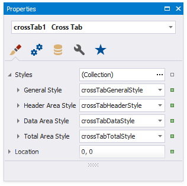
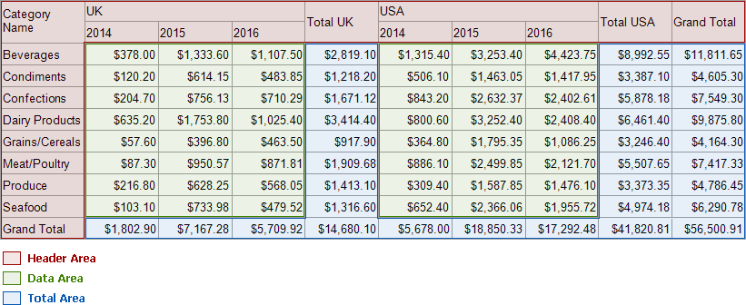
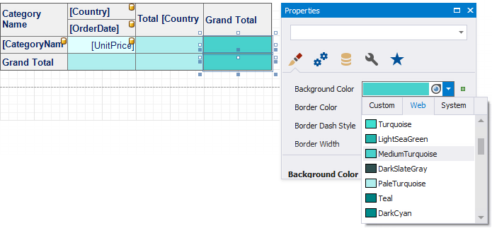
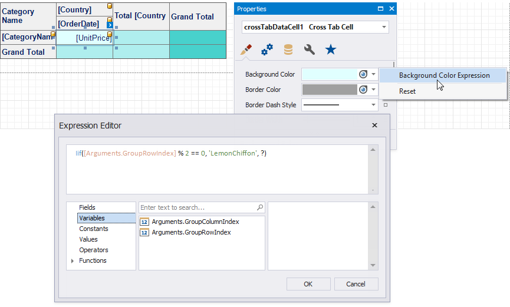

# Cross Tab Appearance

## Customize Appearance

After you drop the Cross Tab from the Toolbox onto a report or finish the Cross-Tab Report Wizard, 4 predefined [report styles](../../customize-appearance/report-visual-styles.md) are created and assigned to the Cross Tab's **Styles**.

Use the **General Style** property to specify common appearance settings that apply to all Cross Tab cells.

Use the **Header Area Style**, **Data Area Style** and **Total Area Style** properties to customize appearance settings of specific areas shown below.

If an area's appearance option is not set, its value is inherited from the general style.

You can also override appearance settings of each Cross Tab cell. These settings have a higher priority over style settings.

## Customize Appearance Conditionally

Specify [expression bindings](../bind-controls-to-data.md) to change a cell's appearance based on a specific condition. You can use the **GroupRowIndex** and **GroupColumnIndex** arguments to identify group indexes (for instance, to define the background color for odd and even rows).

Expressions are evaluated when a report is previewed. The calculated appearance settings have the highest priority. They override a cell's appearance settings and style settings.

