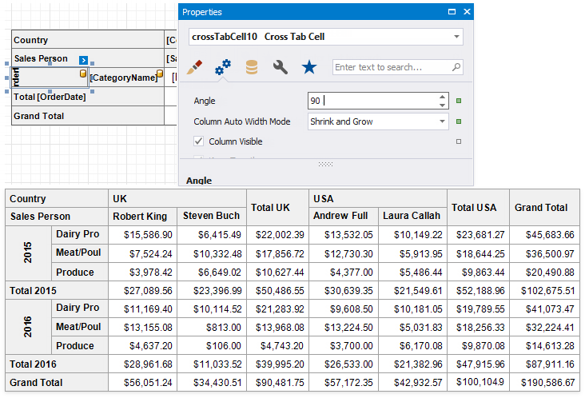

# Layout and Print Options

Use the **Layout Options** property to change the cells' order and location.

* **Column Total Header Position**, **Row Total Header Position**  
    Specifies where to display column/row total headers:
    * show in the same row/column as column/row field values against which totals are calculated (**Inner**);
    * span across two rows/columns (**Outer**).

* **Column Totals Position**, **Row Totals Position**  
    Specifies the position of the column/row totals and column/row grand totals:
    * after column/row field values (**After Data**);
    * before column/row field values (**Before Data**).

* **Corner Header Display Mode**  
    Specifies what data the Cross Tab should display in the top left corner:
    * split the corner into columns and display row field names (**Row Field Names**);
    * split the corner into rows and display column field names (**Column Field Names**);
    * do not split the corner and do not display any text (**None**).

* **Data Field Layout**  
    Specifies how to arrange two or more data fields in the Cross Tab layout:
    * in a row one after another (**InRow**);
    * in a column one under another (**InColumn**).

* **Hierarchical Row Layout**  
    Specifies how to display row headers:
    * in a tree-like view one under another (**checked**)
    * in a single line (**unchecked**).

## Hide Specific Rows and Columns

Use a cell's **Row Visible** and **Column Visible** properties to specify row and column visibility. For instance, select the bottom right cell and disable these options to hide grand totals. At design time, invisible cells are filled with a hatch brush.

## Print Options

Use the **Print Options** property to specify print options and define which Cross Tab elements to print.

* **Print Layout**  
    Specifies how to print the Cross Tab content that does not fit the page's width:
    * on the next page (**Across Only**);
    * on the same page below the previous content (**Across Then Down**).

* **Across Then Down Offset**  
    Specifies the vertical distance between parts of the Cross Tab content in the **Across Then Down** print layout.

* **Print Totals For Single Values**  
    Specifies when to print totals:
    * for any field value even when it contains one nested value (**checked**);
    * for the field values that contain two and more nested values (**unchecked**).

* **Repeat Row Headers**, **Repeat Column Headers**
    Specifies whether to repeat row/column headers when the Cross Tab content is split horizontally/vertically or print them only once.

> [!Note]
> Cross tab cells are split between pages if they do not fit the page's width or height. Set the report's **Vertical Content Splitting** and **Horizontal Content Splitting** properties to **Smart** **Smart** to move cells to the next page (or to the Cross Tab's next part shown on the same page.

## Adjust Control Size

Drag the Cross Tab's handlers to change its size. You can also resize individual rows and columns.

Use a cell's **Column Auto Width Mode** property to specify a cell width calculation method.

Use a cell's **Row Auto Height Mode** property to specify whether and how a cell's height changes to fit its content.

Column widths are changed before row heights.

## Adjust Header Text

You can double-click any cell that displays the header and use the in-place editor to enter text.

Each Cross Tab cell provides the **Angle** property that allows you to rotate the cell's text.

