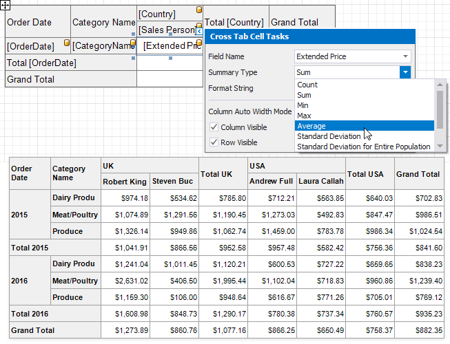
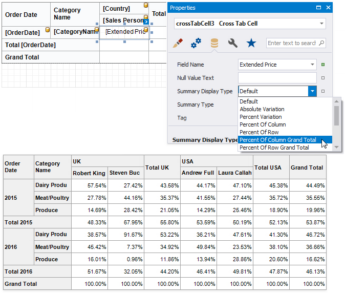
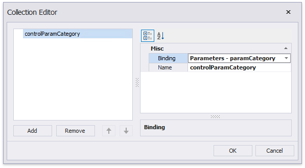

# Data Shaping

## Calculate Totals

The Cross Tab calculates the following automatic totals:

* **Row Totals** - against outer row fields;
* **Row Grand Totals** - against all the rows;
* **Column Totals** - against outer column fields;
* **Column Grand Totals** - against all the columns.

You can use the [layout options](layout-options.md) to move rows and columns that display total values.

If you want to [hide specific totals](layout-options.md#hide-specific-rows-and-columns), select any cell in the row/column and disable the **Row Visible**/**Column Visible** property.

## Change the Summary Type

The Cross Tab summarizes values of [data fields](cross-tab-fields.md#data-fields) and displays the results "as is" at the intersection of the corresponding rows and columns.

Use the **Summary Type** property to specify the summary function calculated against a data field.

Use the **Summary Display Type** property to display results' contribution to other cell values, for example, as a percentage of grand total values.

## Sort Data

The Cross Tab displays row and column field values in the ascending order. Use the **Sort Order** property to change the current sort order. Set this property to **None** to keep the same order as records in the Cross Tab's data source.

You can also use the **Sort By Summary Info** property to arrange row/column field values based on grand totals values.

1. Select a cell you want to sort and expand the **Sort By Summary Info** property in the [Property Grid](../../report-designer-tools/ui-panels/property-grid.md).
1. Set the **Field Name** property to the name of an assigned data source's field. You can also define a field that is not currently displayed in the Cross Tab.
1. Use the **Summary Type** property to specify which summary function to calculate. The summary type can differ from the summary type currently used in the Cross Tab.
1. Use the **Sort Order** property to define the sort order.

    

## Group Data

The Cross Tab displays unique values of column and row fields and does not group their values.

Use the **Group Interval** property to combine original field values into categories (groups). For instance, you can group date-time values by year, month, quarter, day, hour.

To group numeric values, set the **Group Interval** property to **Numeric** and use the **Group Interval Numeric Range** property to specify the interval length. For instance, set the range to **100** to group records by 100 orders.

## Use Parameters

The Cross Tab uses and displays values of data fields from an assigned data source. To provide values outside the data source, use internal Cross Tab parameters. Each parameter is stored in the **Parameters** collection.

You can access the **Parameters** property in the Cross Tab's smart tag or in the Properties window.

Click this property's ellipsis button and add parameters in the invoked Collection Editor. You can bind a Cross Tab parameter to a [report parameter](../../shape-report-data/use-report-parameters.md) or to any data field available in a report.

You can then use the created parameters to [filter the Cross Tab](#filter-data).

## Filter Data

Use the Cross Tab's **Filter String** property to invoke the **FilterString Editor** and specify the filter criteria.

You can use the [Cross Tab's parameters](#use-parameters) in filter criteria.