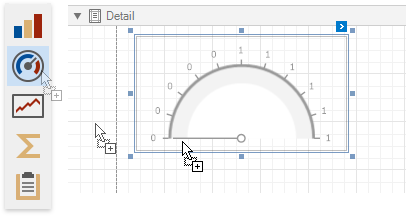
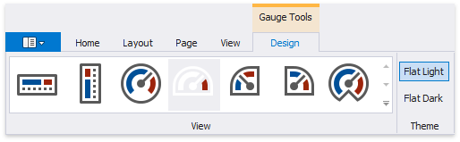
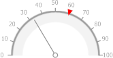
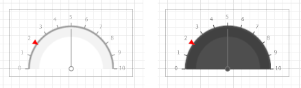
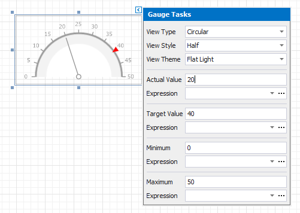
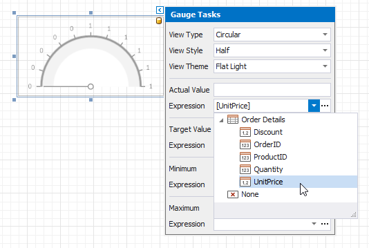

# Add Gauges to a Report

## Gauge Overview

The **Gauge** control provides you with the capability to embed graphical gauges into your report.

To add this control to the report, drag the **Gauge** item from the [Toolbox](../../report-designer-tools/toolbox.md) and drop it onto the report.

Use the [Toolbar](../../report-designer-tools/toolbar.md)'s **Gauge Tools** contextual tab to select a gauge's appearance.

* **View**
	
	Specifies the type of the displayed gauge. The following view types are available:

    * **Linear**
		
		
		
		Supported view styles: **Horizontal** and **Vertical**.
	
	* **Circular**
		
		
		
		Supported view styles: **Full**, **Half**, **Quarter Left**, **Quarter Right** and **Three Fourth**.

* **Theme**
	
	Specifies the gauge's color theme. The **Flat Light** and **Flat Dark** view themes are supported.
	
	

The following properties allow you to customize the gauge scale and specify its displayed values.

* **Actual Value** - specifies the value displayed by a gauge.
* **Target Value** - specifies the position of the target value marker.
* **Maximum** - specifies the gauge's maximum value.
* **Minimum** - specifies the gauge's minimum value.

## Bind a Gauge to Data
To [bind](../../bind-to-data/bind-controls-to-data-expression-bindings.md) the gauge's displayed value to data, click the control's smart tag and in the invoked actions list, expand the **Expression** drop-down list for the **Actual Value** property and select the required data field.

In the same way, you can bind the **Target Value**, **Minimum** and **Maximum** properties to data. To do this, expand the **Expression** drop-down list for the corresponding property and select the required data field.

Clicking the **Expression** option's ellipsis button invokes the **Expression Editor**, in which you can construct a complex binding expression involving two or more data fields.