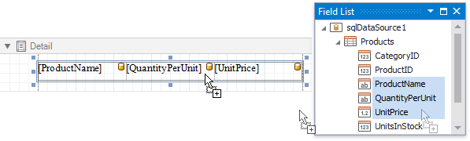
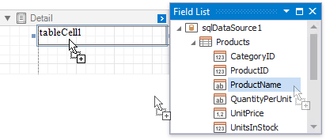
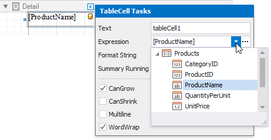
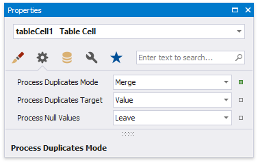

# Bind Table Cells to Data

You can create a table control with cells [bound](../../bind-to-data/bind-controls-to-data-expression-bindings.md) to data fields obtained from a report's data source using the [Field List](../../report-designer-tools/ui-panels/field-list.md). Select data fields by clicking them while holding the CTRL or SHIFT key and drop them onto the Detail band.

Drag and drop the same fields with the right mouse button to create column headers with the corresponding field names.

You can bind individual table cells to data in the same ways as [Label](../use-basic-report-controls/label.md) controls. Dropping a data field onto an existing cell binds this cell to a corresponding field.

Alternatively, click the cell's smart tag, expand the **Expression** drop-down list and select the required data field

Clicking the **Expression** option's ellipsis button invokes the Expression Editor. This allows you to construct a complex binding expression involving two or more data fields.

See the [Bind Report Controls to Data](../../bind-to-data/bind-controls-to-data-expression-bindings.md) topic to learn more about creating data-aware controls.

The **Process Duplicates Mode** and **Process Duplicates Target** options enable you to merge cells with identical values.

