# Hide Table Cells

You can hide a specific table cell conditionally, for instance, based on a [report parameter](../../shape-report-data/use-report-parameters.md) value.

Right-click the **Parameters** section in the [Field List](../../report-designer-tools/ui-panels/field-list.md) and select **Add Parameter**.

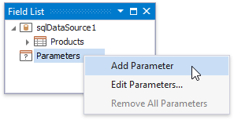

In the invoked **Add New Parameter** dialog, specify the parameter's name and description for Print Preview, and set the type to **Boolean**.

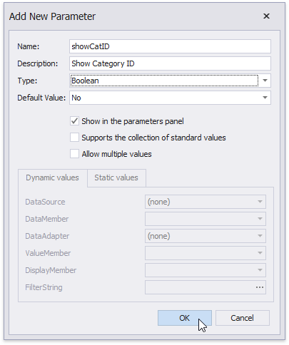

* > [!Warning]
    > Use the approach below if expression bindings **are enabled** in the Report Designer (the [Property Grid](../../report-designer-tools/ui-panels/property-grid.md) provides the **Expressions**  tab ).

    Specify an [expression](../../shape-report-data/shape-data-expression-bindings/conditionally-supress-controls.md) for the cell's **Visible** property to define a logical condition for displaying or hiding this cell.

    The image below demonstrates how to provide the visibility expression for the cell bound to the **CategoryID** field. For a report to display correctly, you should specify the same expression for the cell that displays the field caption in the Page Header.

    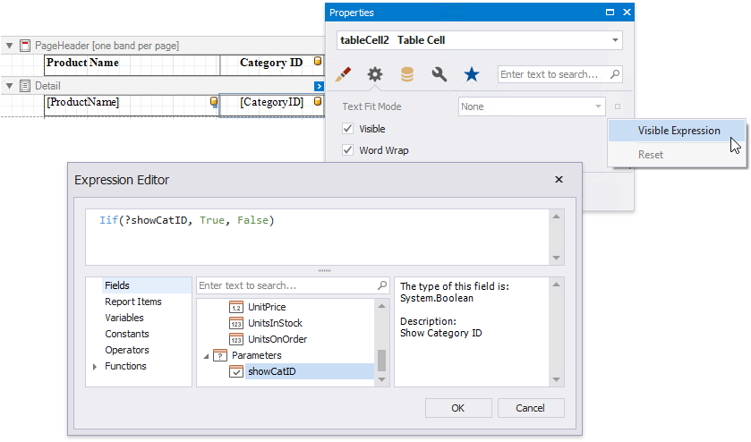

* > [!Warning]
    > Use the approach below if expression bindings **are not enabled** in the Report Designer (the [Property Grid](../../report-designer-tools/ui-panels/property-grid.md) does not provide the **Expressions**  tab ).

    Create a [formatting rule](../../shape-report-data/shape-data-data-bindings/conditionally-supress-controls.md), specify a logical condition to hide a cell and set the **Visible** property to **False** as shown below. For a report to display correctly, apply the created rule to the cells in the Detail band and the Page Header band.

    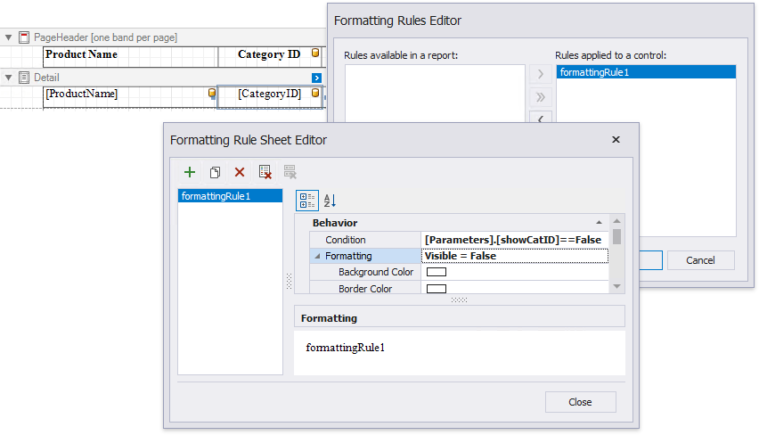

The **Process Hidden Cell Mode** property allows you to define how to distribute the remaining space between the table's visible cells.

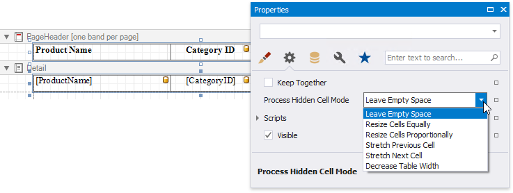

The image below illustrates how the original table looks like:

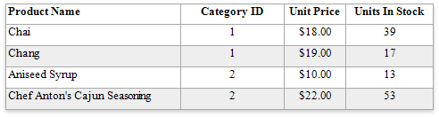

The following modes are available to process hidden cells:

* **StretchPreviousCell** - A cell to the left of the hidden cell is stretched to occupy the available space. If the hidden cell is the first in the row, the next cell is stretched.

    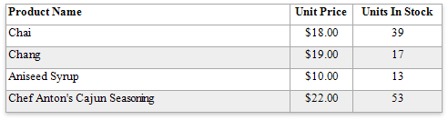

* **StretchNextCell** - A cell to the right of the hidden cell is stretched to occupy the available space. If the hidden cell is the last in the row, the previous cell is stretched.

    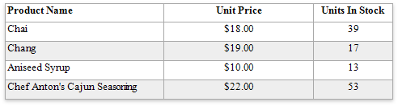

* **ResizeCellsEqually** - All visible cells are resized to divide the space that a hidden cell reserved equally.

    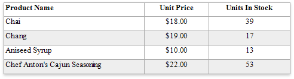

* **ResizeCellsProportionally** - All visible cells are resized to proportionally divide the space that a hidden cell reserved based on their weights in the whole table width.

    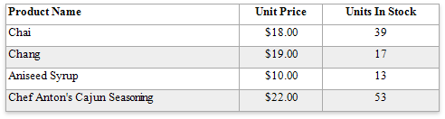

* **DecreaseTableWidth** - The table width is decreased, and visible cells are shifted to a hidden cell's location without changing their size.

    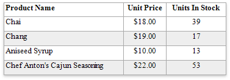

* **LeaveEmptySpace** (the default mode) - A space remains at a hidden cell's location, and other cells are not affected.

    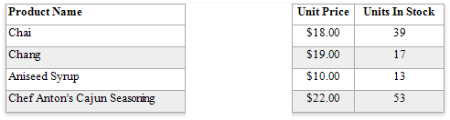

