# Manage Table Structure

## Insert Table Rows and Columns

You can use the **Insert** group in the [toolbar](../../report-designer-tools/toolbar.md)'s **Table Tools** contextual tab or the **Insert** context menu items to add new rows and columns. The added cells inherit the source cells' size and appearance settings.

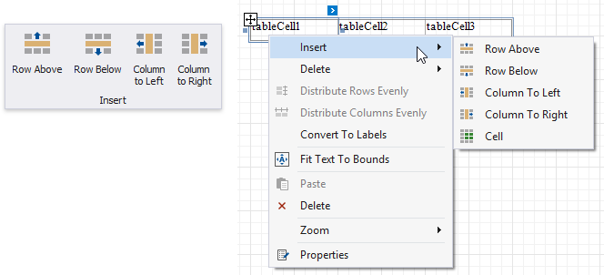

* **Insert Row Above**
    
    Inserts a row above the current cell and shifts the existing rows up if there is enough space above the table (otherwise, shifts the existing rows down).

    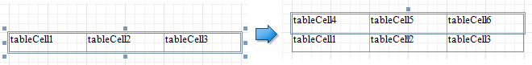

* **Insert Row Below**

    Inserts a row below the current cell and shifts the existing rows down. This command increases the band height to accommodate all the rows if there is not enough space under the table.

    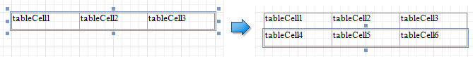

* **Insert Column to Left**

    Inserts a new column to the left of the current cell and shifts the leftmost columns to the left (otherwise, shifts these columns to the right). 

    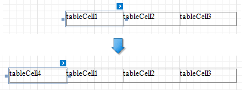

* **Insert Columns to Right**

    Inserts a new column to the right of the current cell and shifts the rightmost columns to the right. This command decreases all columns' width proportionally to accommodate all the columns if there is not enough space to the right of the table.

    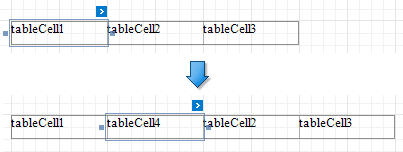

## Insert, Split and Merge Table Cells

* **Insert Cell** (context menu item)

    Divides the current cell width in half and inserts a new cell to the right. The added cell copies the source cell's appearance settings.

    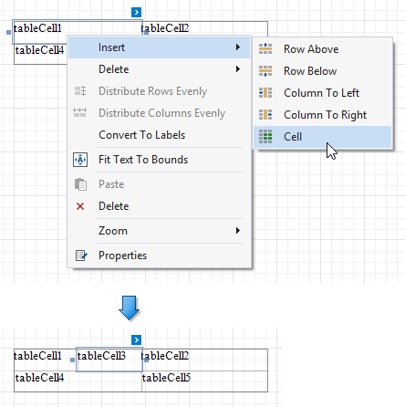

* **Merge Cells**

    Merges the selected cells. This command is available if the selection has a rectangle form. 

    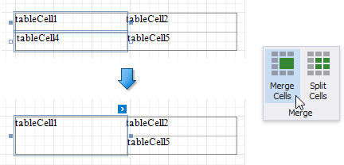

* **Split Cells**

    Invokes the **Split Cells** dialog where you can specify the number of columns and rows to split the selected cells. You can apply this change to each selected cell individually, or merge the cells and then split the resulting cell.

    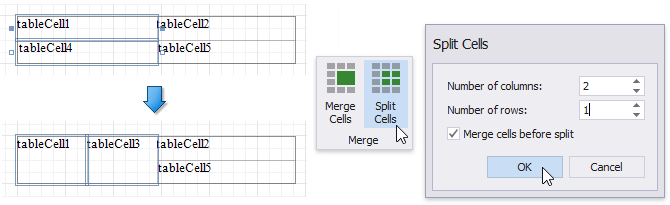

## Delete Table Elements

Use the **Delete** group in the [toolbar](../../report-designer-tools/toolbar.md)'s **Table Tools** contextual tab or the **Delete** context menu items to remove table elements.

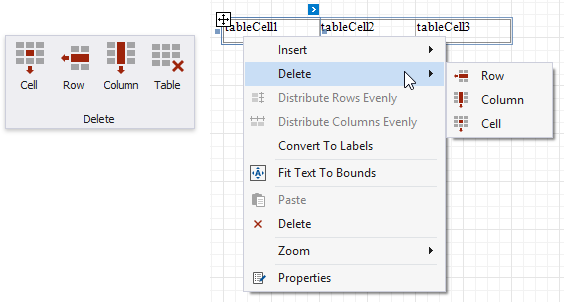

* **Delete Cell**
	
    Deletes a table cell and stretches the previous cell to occupy the remaining space. If this cell is the first in the row, the next cell is stretched.

    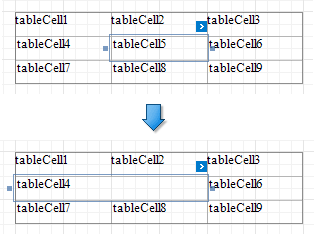

* **Delete Row**

    Deletes a row and shifts the existing rows up.

    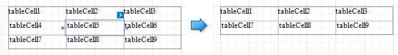

* **Delete Column**

    Deletes a column and shifts the existing columns to the left.

    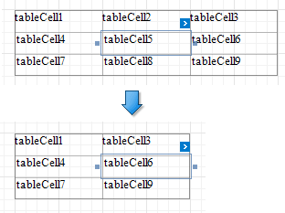

* **Delete Table**

    Deletes the entire table.
