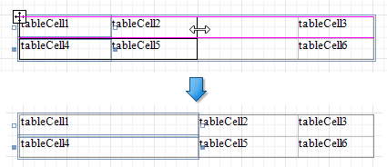

# Manipulate Table Elements

## Select Table Elements
You can click a table cell to select it and [access its settings](../manipulate-report-elements/select-report-elements-and-access-their-settings.md). To select multiple cells, hold the SHIFT or CTRL key and click cells.

Use the arrow that appears when a mouse cursor hovers over the table edges to select an entire row or column.

Click the  button at the table's left bottom corner to select the whole table. You can also use this button to move the table.

The **Select** group in the [toolbar](../../report-designer-tools/toolbar.md)'s **Table Tools** contextual tab also enables you to select the current row, the current column or the entire table.

## Resize Table Elements
You can resize a table or its cell by dragging the rectangle drawn on its edge or corner. 

The following column resizing modes are supported:

* Resizing a column changes the next column's width without affecting the other columns (keeps the table dimensions intact).
	
	

* Resizing a column while holding the CTRL key changes the next columns' width while maintaining their proportion to the overall table (keeps the table dimensions intact).
	
	

* Resizing a column while holding the SHIFT key shifts the next columns without changing their size.
	
	

The following row resizing modes are supported:

* Resizing a row changes the next row's width without affecting the other rows (keeps the table dimensions intact).
	
	

* Resizing a row while holding the SHIFT key shifts the next rows without changing their size.
	
	

You can set the same size for multiple table columns or rows. Select the required rows or the whole table, right-click the selected area and choose **Distribute Rows Evenly**.

If the cell's content is partially visible in the resulting row, this row automatically increases its height to fit its content and also adjusts the other rows accordingly.

You can resize columns equally in a similar way by selecting the columns or the table itself and choosing **Distribute Columns Evenly** in the context menu.

## Stretch Table Cells
You can stretch a cell so that it occupies several rows and columns. To stretch a cell across several columns, remove a neighboring cell by pressing DELETE or selecting **Delete** | **Cell** in the context menu and resize the remaining cells.

Use a table cell's **Row Span** property to specify the number of rows the table cell spans.

