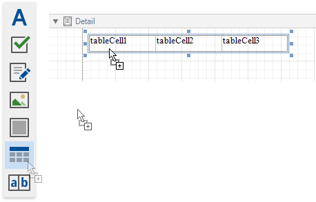

# Table Overview

The **Table** control displays information in a tabular format and allows you to create  [table reports](../../create-popular-reports/create-a-table-report.md).

You can add a table control by dragging the **Table** item from the [Toolbox](../../report-designer-tools/toolbox.md) onto the report's area.

You can also create two tables simultaneously, for instance, one that shows column titles in the Page Header and one that shows regular information in the Detail band. Select the **Table** item in the Toolbox and draw a rectangle across these bands.

The table control contains one or more rows. Each row contains one or more cells. See the [Report Explorer](../../report-designer-tools/ui-panels/report-explorer.md) for a table structure example.

You can double-click the cell to invoke its in-place editor and type the desired static text.

You can adjust the font size of a cell's static text to fit into the cell's boundaries. Use the **Fit Text to Bounds** button in the [toolbar](../../report-designer-tools/toolbar.md)'s **Text** contextual tab, or right-click this cell and select **Fit Text to Bounds** in the context menu.

Refer to [Bind Table Cells to Data](bind-table-cells-to-data.md) to learn about providing dynamic content to table cells.

A table cell is like an [Label](../use-basic-report-controls/label.md) control - it provides the same options for text formatting, alignment, appearance, interactivity, etc. 

You can also make a table cell act as a container for other report controls by dropping the required control from the toolbox on this cell.

If a table cell includes only one control, you can right-click this control and use the **Fit Bounds to Container** command in the context menu. The same command is available in the toolbar's **Layout** tab. This command resizes the control so that it occupies all the available cell space (excluding borders).

To transform a table into a set of Label controls, right-click a table or any of its cells and select **Convert To Labels**. Table cells containing other controls are converted to [Panel](../use-basic-report-controls/panel.md) controls.

You can assign different [visual styles](../../customize-appearance/report-visual-styles.md) for even and odd table rows to improve readability.