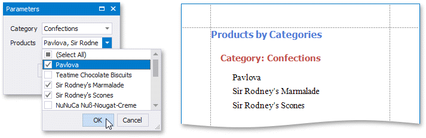
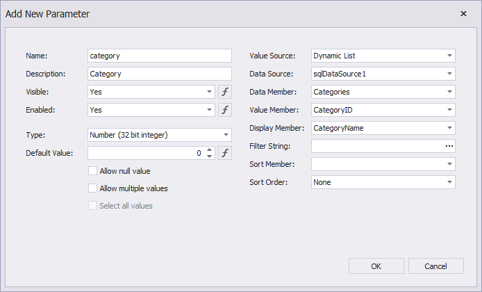
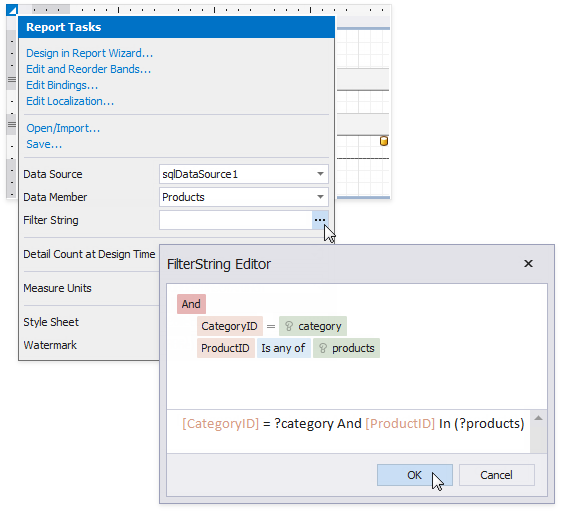

# Cascading Report Parameters

You can create cascading parameters to filter a list of predefined parameter values based on values in another parameter.

> [!TIP]
> Refer to the following topics for information on how to create a list of predefined parameter values:
> * [Report Parameters with Predefined Static Values](report-parameters-with-predefined-static-values.md)
> * [Report Parameters with Predefined Dynamic Values](report-parameters-with-predefined-dynamic-values.md)

Follow the steps below to create cascading parameters in the [Report Designer](../../report-designer-for-winforms.md):

1. [Create a report parameter](create-a-report-parameter.md) you want to use to filter values of another parameter.

    

2. Create a report parameter whose values you want to filter. Click the **Filter String** property's ellipsis button in the **Add New Parameter** dialog and specify a filter string that references the parameter you created in the first step.

    

    > [!NOTE]
    > In a filter string for a parameter's look-up values, you can reference only those parameters that you created before the parameter whose look-up values you want to filter. You can use the **Report Parameters Editor** to change the order in which you created the parameters. To invoke the editor, right-click the **Parameters** node in the [Field List](../report-designer-tools/ui-panels/field-list.md) and select **Edit Parameters**.

3. In the report's smart tag, click the **Filter String** property's ellipsis button. In the invoked **FilterString Editor**, specify an expression that uses both parameters to filter report data:

    

The following image illustrates cascading parameters where the **Product** parameter values are filtered by the selected **Category**.

## Cascading Parameters Filtering Specifics

Cascading parameters can be filtered on the database level (server side) or on the application level (client side). For the following datasources, such parameters are filtered on the database level:

* [SQL Database](../bind-to-data/bind-a-report-to-a-database.md)
* [MongoDB Instance](../bind-to-data/bind-a-report-to-a-mongodb-instance.md)
* [Entity Framework](../bind-to-data/bind-a-report-to-an-entity-framework-data-source.md)

In case of SQL databases, database level filter operations do not work for stored procedures and custom SQL queries. For such queries, filters are always applied on the application level.

When your report is bound to one of the above datasources, and you change the value of the primary parameter (for example, the **Category** parameter in the image above), your application does the following:

* Makes a request to a database.
* Applies a filter on the database level (for example, filters the values of the Products parameter based on the Category parameter value).
* Loads the filtered data to your report.

You can also apply filter operations for the mentioned datasources on the application level. For this, disable the **Use Server Side Filtering** property (locataed in a parameter's **Value Source** category).

For the rest of the datasources, filter operations for cascading parameters are always applied on the application level.