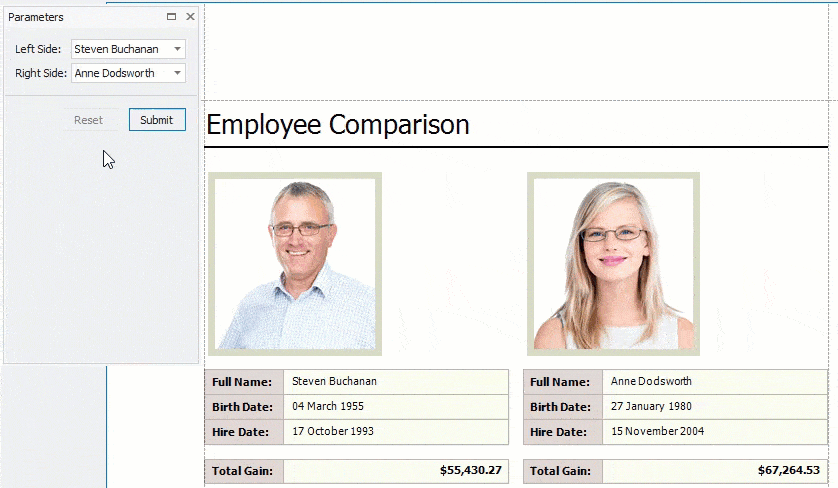
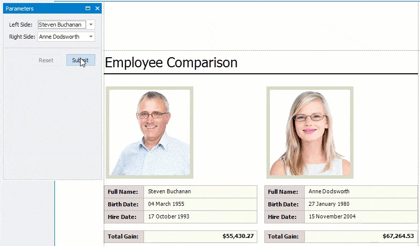
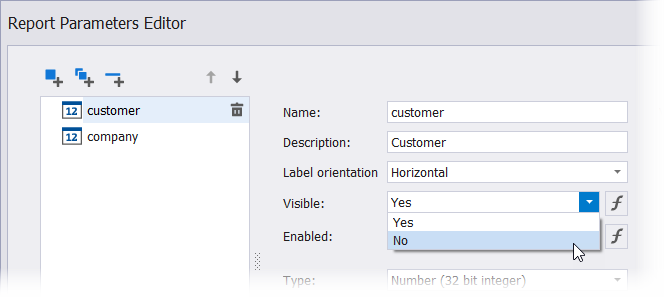

# The Parameters Panel

The **Parameters** panel allows you to specify parameter values in a report's **Print Preview**.

## Submit Parameter Values

When you open a report's **Print Preview**, the **Parameters** panel displays default parameter values and descriptions.

Specify parameter values and click **Submit** to generate the report's **Print Preview**. Set the report's **RequestParameters** property to **false** to display a report document for the default parameter values when you open the **Print Preview**.

## Reset Parameter Values to Defaults

Click the **Reset** button to reset parameter values to defaults. 

## Hide the Parameters Panel

To remove the **Parameters** panel from a report's **Print Preview**, disable the **Visible** option for all report parameters in the **Report Parameters Editor**.

When you hide the **Parameters** panel, the report's **Print Preview** is generated with the default parameter values.