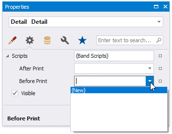
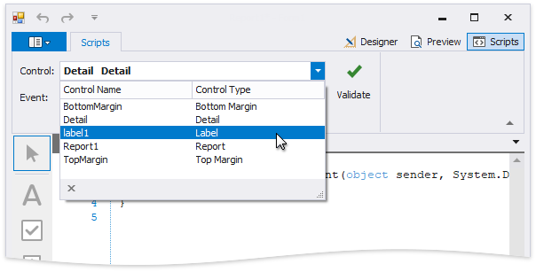
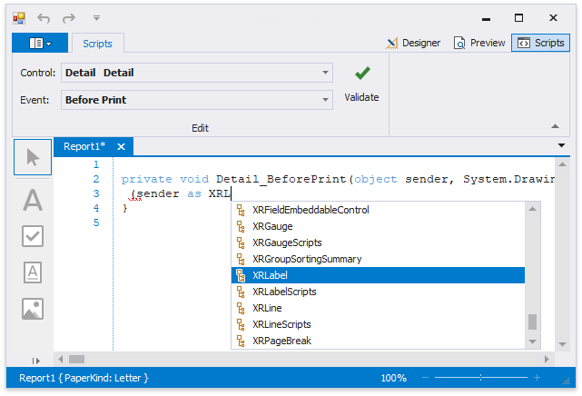
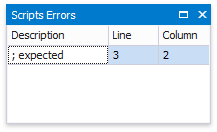

# Handle Events via Scripts
This document describes the basic principles of _scripting_, which can be performed by handling the events of a report, and its [bands](introduction-to-banded-reports.md) and [controls](use-report-elements.md).

_Scripts_ are program commands, placed within the _event handlers_ of the required report elements. And, when the corresponding event occurs (e.g. a mouse click), the script code runs.

You can write _scripts_ for a report or any of its elements (bands and controls), to be executed when the report is being [previewed, printed or exported](preview-print-and-export-reports.md).

In the [Property Grid](report-designer-tools\ui-panels\property-grid.md), expand the **Scripts** property for the required element. Every report element has an individual set of script events. 

After you click **(New)** for an event (e.g. the **Before Print**, which is the most used), the **Scripts Tab** is switched on, where you can manage and edit all the report's scripts.

In this tab, for a selected event, a script template is auto-added, in the language specified via the **Script Language** property of the report.

This tab contains all scripts written for all report elements, and allows you to quickly navigate through them by choosing the required report element in the corresponding drop-down list, and specifying one of its available events in another menu.

The script editor supports intelligent code completion that makes it easier and faster for you to write scripts. Context-aware hints are displayed on typing a dot or pressing CTRL+spacebar.

You can verify that your report's scripts are valid, by clicking **Validate**. The validation result is then displayed in the **Scripts Errors** panel.

To proceed to the line that contains an error, click that error in the Error List panel.

Note that scripts are saved to a file along with the report's layout.

