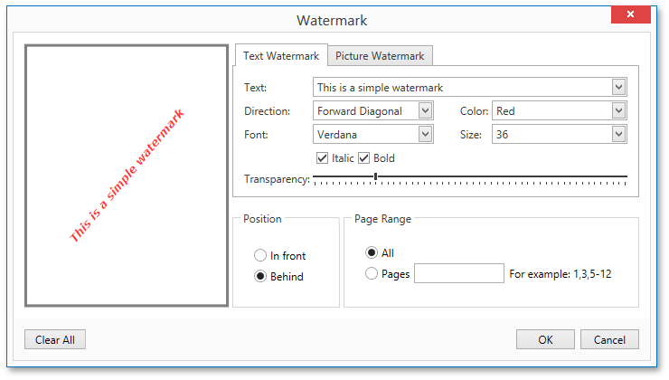
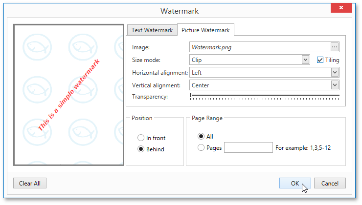
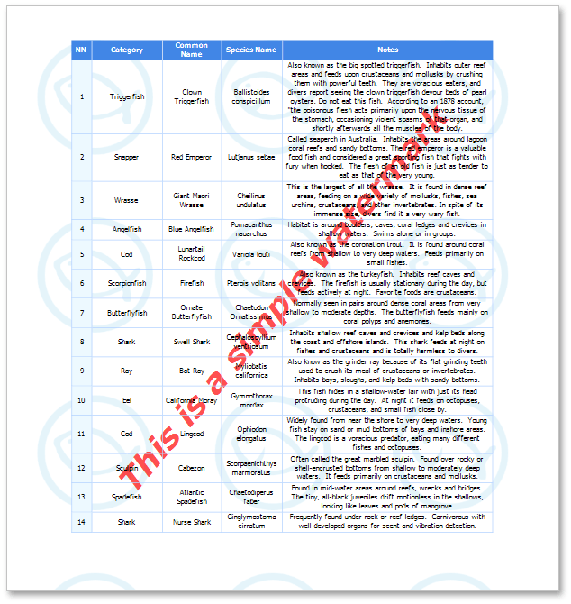

# Create or Modify Watermarks of a Report
This document describes how to add a text _watermark_ in a report, or turn a picture into a report's _background_. Note that watermarks are visible only in the [Preview](../../document-preview.md) mode.

To create a new watermark in a report (or to modify the existing one), do the following.
1. Right-click the report, and in the invoked context menu, click the **Watermark...** link.
	
	
2. In the **Text Watermark** tab of the invoked **Watermark** dialog, enter the watermark's text and specify the required properties such as the **Direction**, **Transparency**, **Color**, etc.
	
	
3. Then, switch to the **Picture Watermark** tab to load the image to be used as a watermark. To do this, click the ellipsis button for the **Image** property. In the invoked dialog, select the file containing the image that you wish to load and click **Open**.
	
	
4. Next, define the picture's properties, such as the **Size mode**, **Alignment** , **Transparency**, etc.
	
	
5. In addition, you can select a watermark position behind or in front of the document, and specify the page range in which the watermark will be printed.
	
	As you can see, it is possible to use both textual and image watermarks simultaneously.

The report with watermark is now ready. Switch to the [Print Preview](../../document-preview.md) tab and view the result.

