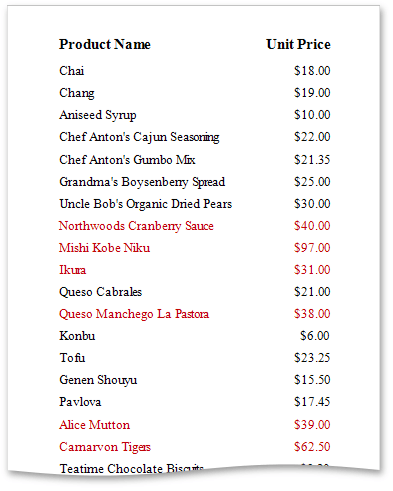

# Conditionally Change a Control's Appearance
This tutorial describes how to conditionally change a control's appearance (e.g., make a [Label](../../../../../../interface-elements-for-desktop/articles/report-designer/report-designer-for-wpf/report-elements/report-controls.md)'s text red if its value exceeds a certain threshold). Thanks to the _formatting rules_ feature, no [scripts](../../../../../../interface-elements-for-desktop/articles/report-designer/report-designer-for-wpf/creating-reports/scripting.md) are required to complete this task, so you should not have to write any code.

To conditionally change a control's appearance, do the following.
1. [Create a new report](../../../../../../interface-elements-for-desktop/articles/report-designer/report-designer-for-wpf/creating-reports/basic-operations/create-a-new-report.md) and [bind it to a data source](../../../../../../interface-elements-for-desktop/articles/report-designer/report-designer-for-wpf/creating-reports/providing-data/binding-a-report-to-data.md).
2. Right-click the report and select **Edit Formatting Rule Sheet...** in the invoked context menu.
	
	
3. In the invoked **Formatting Rule Sheet Editor**, create a new formatting rule using the plus button, and then, click the ellipsis button for its **Condition** property.
	
	
4. In the invoked **Expression Editor**, define the required Boolean condition (which means that its result is returned as either **true** or **false**). This tutorial demonstrates how to format fields if the **UnitPrice** value is greater than **30**.
	
	
	
	To save the condition and close the dialog, click **OK**.
5. Return to the **Formatting Rule Sheet Editor** and define the formatting to be applied, e.g., specify the desired foreground color.
	
	
	
	To save the changes and quit the dialog, click **OK**.
6. Finally, select the band or control to which the formatting rule should be applied (in this example, it is the [Detail band](../../../../../../interface-elements-for-desktop/articles/report-designer/report-designer-for-wpf/report-elements/report-bands.md)), and select **Edit Formatting Rules...** in the context menu.
	
	
7. In the invoked **Formatting Rules Editor**, move the rule from left to right using the right arrow button so that you can apply the rule for this band.
	
	
	
	If multiple rules are applied, it is possible to customize their precedence using the up and down arrow buttons. So, the rules are applied in the same order that they appear in the list, and the last rule in the list has the highest priority.

Switch your report to the [Print Preview](../../../../../../interface-elements-for-desktop/articles/report-designer/report-designer-for-wpf/document-preview.md) tab and view the result.

