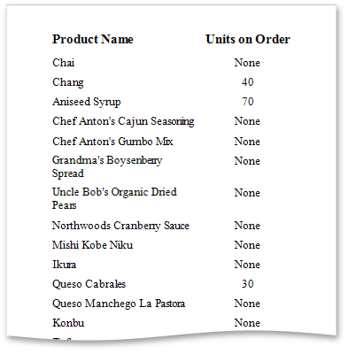

# Conditionally Change a Label's Text
This tutorial demonstrates how to change a label's text if a certain condition is met. No [scripts](../../../../../../interface-elements-for-desktop/articles/report-designer/report-designer-for-wpf/creating-reports/scripting.md) are required to accomplish this task.

To conditionally change a label's text, do the following.
1. [Create a new report](../../../../../../interface-elements-for-desktop/articles/report-designer/report-designer-for-wpf/creating-reports/basic-operations/create-a-new-report.md) and [bind it to a data source](../../../../../../interface-elements-for-desktop/articles/report-designer/report-designer-for-wpf/creating-reports/providing-data/binding-a-report-to-data.md).
2. Next, add a calculated field. To do this, in the [Field List](../../../../../../interface-elements-for-desktop/articles/report-designer/report-designer-for-wpf/interface-elements/field-list.md), right-click any item inside the created data source, and in the invoked context menu, select **Add Calculated Field**.
	
	
3. Select the calculated field, and in the [Properties Panel](../../../../../../interface-elements-for-desktop/articles/report-designer/report-designer-for-wpf/interface-elements/properties-panel.md), set its **Field Type** to **String**. Then, click the ellipsis button for the **Expression** property.
	
	In the invoked **Expression Editor**, specify the required logical condition for the calculated field (e.g., **Iif([UnitsOnOrder] == 0, 'None', [UnitsOnOrder])**, which means that if the **UnitsOnOrder** data field's value is equal to **0**, the control's text will be replaced with **None**).
	
	
	
	To save the changes and close the dialog, click **OK**.
4. Finally, drop the required data fields and the created calculated field from the Field List onto the report's [Detail band](../../../../../../interface-elements-for-desktop/articles/report-designer/report-designer-for-wpf/report-elements/report-bands.md).
	
	

The report is now ready. Switch to the [Print Preview](../../../../../../interface-elements-for-desktop/articles/report-designer/report-designer-for-wpf/document-preview.md) tab and view the result.

