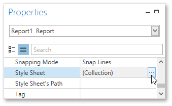
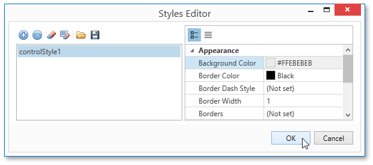

# Use Odd and Even Styles
This tutorial describes how to apply _odd and even styles_ to [report controls](../../report-elements/report-controls.md), e.g., to alternate the background color for each record.

To utilize odd and even styles, do the following.
1. Create a [table report](../../report-types/table-report.md).
2. In the [Properties Panel](../../interface-elements/properties-panel.md), click the ellipsis button for the report's **Style Sheet** property.
	
	
3. In the invoked **Styles Editor**, click the plus button to add a new style. Then, adjust the required options, e.g., set the **Background Color**.
	
	
	
	Click **OK** to apply changes and quit the dialog.
4. Select the detail table, and in the [Properties Panel](../../interface-elements/properties-panel.md), expand its **Styles** option. Invoke the drop-down list for the **Even Style** property and select the created style.
	
	

If required, perform the same steps to create and assign an odd style.

Switch to the [Print Preview](../../document-preview.md) tab and view the result.

