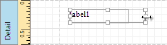

This document describes how to customize the [report elements](../../../../../../interface-elements-for-desktop/articles/report-designer/report-designer-for-wpf/report-elements.md) layout and consists of the following sections.
* [Selecting Report Elements](#selecting)
* [Moving Report Elements](#moving)
* [Resizing Report Elements](#resizing)

<a name="selecting"/>

## Selecting Report Elements
To select a [report control](../../../../../../interface-elements-for-desktop/articles/report-designer/report-designer-for-wpf/report-elements/report-controls.md) or [band](../../../../../../interface-elements-for-desktop/articles/report-designer/report-designer-for-wpf/report-elements/report-bands.md), click it. To select the next element in the tab order, press TAB. To select the previous element in the tab order, click SHIFT + TAB.

To select multiple elements, do one of the following.
* Click report elements while holding down the CTRL or SHIFT key.
* Click on a blank space and drag the mouse to create a selection frame. When the mouse button is released, all controls within the selection frame's boundaries will be selected. In this case, the previous selection is cleared.
	
	

<a name="moving"/>

## Moving Report Elements
To move a report control, select it and drag to the new location. To move it using the keyboard, press the arrow keys.

You can also move multiple selected report controls in the same way as individual controls.

The report controls can be precisely aligned to each other using the **Snap Gird** and/or **Snap Lines**. For details on this, refer to [Control Positioning ](../../../../../../interface-elements-for-desktop/articles/report-designer/report-designer-for-wpf/creating-reports/basic-operations/control-positioning.md).

<a name="resizing"/>

## Resizing Report Elements
To resize a control using the mouse, select it and then drag a rectangle drawn on its edge or corner.

You can also select multiple controls and resize them in the same way as individual controls.

To resize a report band, drag its bottom border.

