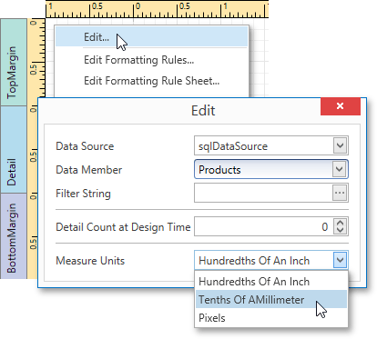

For your report, you can choose its global **Measure Units**, which can be **Hundredths of an Inch**, **Tenths of a Millimeter** or **Pixels**.

To specify the **Measure Unit** property, do one of the following.
* Right-click the report and select **Edit...** in the context menu. In the invoked dialog, set this property to the required value.
	
	
* Select the report and switch to the [Properties Panel](../../../../../../interface-elements-for-desktop/articles/report-designer/report-designer-for-wpf/interface-elements/properties-panel.md). Expand the **Measure Units** drop-down and select the required value.
	
	

This defines the basic measurement unit for all the unit-related options of a report and its [bands](../../../../../../interface-elements-for-desktop/articles/report-designer/report-designer-for-wpf/report-elements/report-bands.md) and [controls](../../../../../../interface-elements-for-desktop/articles/report-designer/report-designer-for-wpf/report-elements/report-controls.md) (such as location, size, border width, etc.) as well as the measurement unit of the report's [Snap Grid](../../../../../../interface-elements-for-desktop/articles/report-designer/report-designer-for-wpf/creating-reports/basic-operations/control-positioning.md).