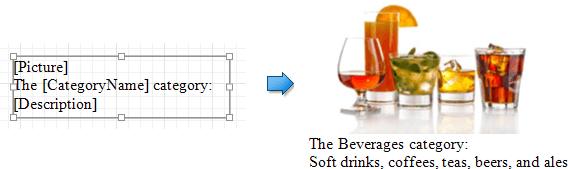

# Using Mail Merge
The _mail merge_ feature allows you to combine both static and [dynamic](binding-report-controls-to-data.md) content within the same [report control](../../report-elements/report-controls.md). For instance, you can append some text prefix or postfix to a value obtained from a database, or even bind a control to multiple data fields at one time.

Mail merge is available for the following controls.
* Label
* Table Cell
* Check Box
* Bar Code
* Zip Code

To embed dynamic data into a control's static content, type in data field names surrounded by **[**square brackets**]**. If this field is valid in the current data context, it will be replaced with an appropriate data value when a report is previewed or exported. Since this data field is inserted into a label's text, you may also use any prefix or postfix. Moreover, you can insert several embedded fields into the **Text** of a single control, and all these embedded fields should be processed correctly.

To embed a parameter's value into a control's content, use the **Parameters.ParameterName** syntax.

