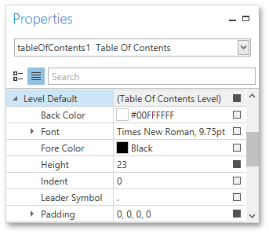

# Create a Table of Contents
This tutorial describes how to create a report with a table of contents, which is automatically created based on the [bookmarks](../../../../../../interface-elements-for-desktop/articles/report-designer/report-designer-for-wpf/creating-reports/report-navigation-and-interactivity/add-bookmarks.md) existing in a report.

To insert a table of contents into a report, do the following.
1. Drop the [Table Of Contents](../../../../../../interface-elements-for-desktop/articles/report-designer/report-designer-for-wpf/report-elements/report-controls.md) control from the [Toolbox](../../../../../../interface-elements-for-desktop/articles/report-designer/report-designer-for-wpf/interface-elements/control-toolbox.md) onto the [Report Header Band](../../../../../../interface-elements-for-desktop/articles/report-designer/report-designer-for-wpf/report-elements/report-bands.md).
	
	
	
	Alternatively, you can double-click the control in the Toolbox. In this case, if the report does not contain a Report Header, it will be created automatically, so that the table of contents can be added to it.
2. Double-click the title of the table of contents and specify its text.
	
	
3. To customize the title's appearance, use the **Level Title** option's settings available in the [Properties Panel](../../../../../../interface-elements-for-desktop/articles/report-designer/report-designer-for-wpf/interface-elements/properties-panel.md).
	
	
4. To customize the appearance of all other levels, use the **Level Default** option's settings.
	
	
5. To customize a specific level individually, add a corresponding item to the **Levels** collection of the table of contents.
	
	
	
	After adding a new level, you can access and customize its properties.

The table of contents are now ready. Switch to the [Print Preview](../../../../../../interface-elements-for-desktop/articles/report-designer/report-designer-for-wpf/document-preview.md) and view the result.

