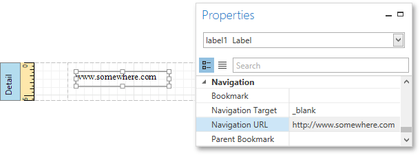

This tutorial demonstrates how to embed a _hyperlink_ into your report. In this case, a label behaves as a hyperlink in a report's [Print Preview](../../../../../../interface-elements-for-desktop/articles/report-designer/report-designer-for-wpf/document-preview.md),  and when the report is exported to PDF, HTML, MHT, RTF, XLS and XLSX formats.

To insert a hyperlink into your report, do the following.
1. [Create a new report](../../../../../../interface-elements-for-desktop/articles/report-designer/report-designer-for-wpf/creating-reports/basic-operations/create-a-new-report.md).
2. Drop a [Label](../../../../../../interface-elements-for-desktop/articles/report-designer/report-designer-for-wpf/report-elements/report-controls.md) onto the report, and in the [Properties Panel](../../../../../../interface-elements-for-desktop/articles/report-designer/report-designer-for-wpf/interface-elements/properties-panel.md), change its **Text** to the one required for the link.
	
	
3. Then, set the **Navigation Target** to the required value (__blank_, __parent_, __search_, __self_, or __top_), and define the required **Navigation URL**.
	
	
4. In addition, to make the label look like a typical link, you can change its appearance appropriately (e.g., make it blue and underlined).

The hyperlink is now ready. Switch to the [Print Preview](../../../../../../interface-elements-for-desktop/articles/report-designer/report-designer-for-wpf/document-preview.md) tab and view the result.

