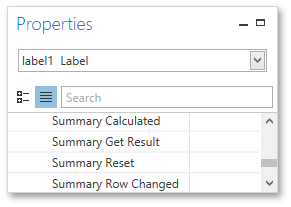

# Scripting
This document describes the basic principles of _scripting_, which can be performed by handling the events of a report, and its [bands](../report-elements/report-bands.md) and [controls](../report-elements/report-controls.md).

This documents consists of the following sections.
* [Scripting Overview](#overview)
* [Maintaining Scripts](#maintain)
* [Example: Custom Summary](#example)

<a name="overview"/>

## Scripting Overview
_Scripts_ are program commands, placed within the _event handlers_ of the required report elements. And when the corresponding event occurs (e.g., a mouse click), the script code runs. Scripting is made available to extend the standard functionality as far as may be required.

You can write _scripts_ for a report or any of its elements (bands and controls) to be executed when the report is being [previewed, printed or exported](../document-preview.md).

The Report Designer allows you to write scripts using the [Script Editor](../interface-elements/script-editor.md). This editor supports **C#** and **Visual Basic .NET** scripting languages. This means that the scripting language is independent from the language used to create the report. The language is specified by the **Script Language** property of a report. The selected scripting language must be the same for all scripts used in a report.


<a name="maintain"/>

## Maintaining Scripts
Each report element has its own set of events, which are individual for each element type. To handle an event of a report element, do one of the following.
* Select the required report element (e.g., on the [Design Surface](../interface-elements/design-surface.md)). In the [Properties Panel](../interface-elements/properties-panel.md), expand the **Scripts** property and click the plus button for the event.
	
	
* Click the **Scripts** button () in the [Toolbar](../interface-elements/toolbar.md) to display the Script Editor. Choose the required report element in the dedicated drop-down list at the left top of the Script Editor. Then, select one of the available events in another list at the right top.
	
	

After the event is specified, a code template is automatically generated in the current scripting language and added in the Script Editor.


To check for errors in the report's script, click the **Validate** button. The validation result is displayed in the errors panel at the bottom of the Script Editor. Double-click the error item in the panel's list to go to the corresponding line of code. If all scripts are valid, the errors panel is empty.


<a name="example"/>

## <a name="example"/>Example: Custom Summary
This example demonstrates how to display the total number of product unit packs in a group.

To perform this, execute steps similar to the ones described in [Calculating Summaries](shaping-data/calculating-summaries.md), except that for the summary field, you should set the **Function** property to **Custom**.


Then, the additional events are added to the label's **Scripts** property.



You can handle these events in the following way.

**C#**

```csharp

// Declare a summary and a pack.
double totalUnits = 0;
double pack = 15;

private void label1_SummaryReset(object sender, System.EventArgs e) {
    // Reset the result each time a group is printed.
    totalUnits = 0;
}

private void label1_SummaryRowChanged(object sender, System.EventArgs e) {
    // Calculate a summary.
    totalUnits += Convert.ToDouble(GetCurrentColumnValue("UnitsOnOrder"));
}

private void label1_SummaryGetResult(object sender, 
DevExpress.XtraReports.UI.SummaryGetResultEventArgs e) {
    // Round the result, so that a pack will be taken into account 
    // even if it contains only one unit.
    e.Result = Math.Ceiling(totalUnits / pack);
    e.Handled = true;
}

```
**VB.NET**

```vb

' Declare a summary and a pack.
Private totalUnits As Double = 0
Private pack As Double = 15

Private Sub label1_SummaryReset(ByVal sender As Object, ByVal e As System.EventArgs)
    ' Reset the result each time a group is printed.
    totalUnits = 0
End Sub

Private Sub label1_SummaryRowChanged(ByVal sender As Object, ByVal e As System.EventArgs)
    ' Calculate a summary.
    totalUnits += Convert.ToDouble(GetCurrentColumnValue("UnitsOnOrder"))
End Sub

Private Sub label1_SummaryGetResult(ByVal sender As Object,  _ 
ByVal e As DevExpress.XtraReports.UI.SummaryGetResultEventArgs)
    ' Round the result, so that a pack will be taken into account 
    ' even if it contains only one unit.
    e.Result = Math.Ceiling(totalUnits / pack)
    e.Handled = True
End Sub

```

Finally, switch to the [Print Preview](../document-preview.md) tab and view the result.

