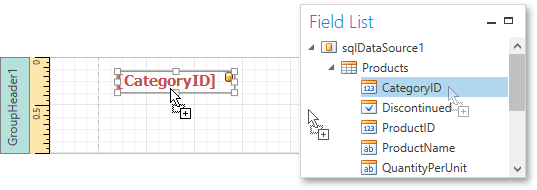
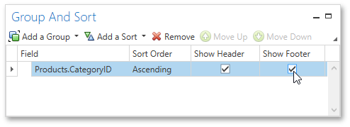
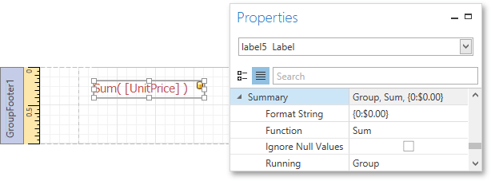

# Grouping Data
This document demonstrates how to group report data. Grouping allows you to split data into groups based on identical values in a field or fields. Note that data grouping can be performed only if a report is [bound to a data source](../../../../../../interface-elements-for-desktop/articles/report-designer/report-designer-for-wpf/creating-reports/providing-data/binding-a-report-to-data.md).

To group records in a report, do the following.
1. [Create a new report](../../../../../../interface-elements-for-desktop/articles/report-designer/report-designer-for-wpf/creating-reports/basic-operations/create-a-new-report.md) and [bind it to a data source](../../../../../../interface-elements-for-desktop/articles/report-designer/report-designer-for-wpf/creating-reports/providing-data/binding-a-report-to-data.md). This tutorial starts with the following report.
	
	
2. Next, switch to the [Group and Sort Panel](../../../../../../interface-elements-for-desktop/articles/report-designer/report-designer-for-wpf/interface-elements/group-and-sort-panel.md), and click **Add a Group**. In the invoked drop-down list, select a data member across which the report is to be grouped.
	
	
3. After this, the [Group Header](../../../../../../interface-elements-for-desktop/articles/report-designer/report-designer-for-wpf/report-elements/report-bands.md) band is added to the report with the specified data member set as its grouping criterion.
	
	Drop the data field, which is specified as the grouping criterion, from the [Field List](../../../../../../interface-elements-for-desktop/articles/report-designer/report-designer-for-wpf/interface-elements/field-list.md) panel onto the Group Header band. This data field will be displayed as a header for each group.
	
	
4. In addition, you can enable the corresponding Group Footer band by enabling the **Show Footer** option in the Group and Sort Panel.
	
	
	
	Use the **Sort Order** drop-down list to manage the sorting order of the group's items (ascending or descending) or to disable sorting in grouped data. If multiple groups are created, you can specify the priority for each group by selecting it in the Group and Sort Panel and using the **Move Up** and **Move Down** buttons.
5. Then, you can [calculate a total](../../../../../../interface-elements-for-desktop/articles/report-designer/report-designer-for-wpf/creating-reports/shaping-data/calculating-summaries.md) across the group by placing a [Label](../../../../../../interface-elements-for-desktop/articles/report-designer/report-designer-for-wpf/report-elements/report-controls.md) onto the Group Footer band and specifying its **Summary** properties in the following way.
	
	
	
	Note also that value formatting is applied to a summary independently of the [general formatting](../../../../../../interface-elements-for-desktop/articles/report-designer/report-designer-for-wpf/creating-reports/shaping-data/formatting-data.md), and has a greater priority.

The report is now ready. Switch to the [Print Preview](../../../../../../interface-elements-for-desktop/articles/report-designer/report-designer-for-wpf/document-preview.md) tab and view the result.

