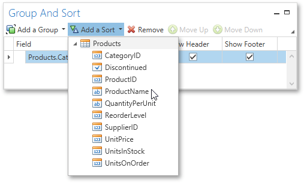

# Sorting Data
This document demonstrates how to sort report data. Note that as with data grouping, sorting can be performed only if a report is [bound to a data source](../providing-data/binding-a-report-to-data.md). This example uses the report created in the following tutorial: [Grouping Data](grouping-data.md).

To sort records in a data-aware report, do the following.
1. Switch to the [Group and Sort Panel](../../interface-elements/group-and-sort-panel.md), and click **Add a Sort**. In the invoked drop-down list, choose a data field across which the report is to be sorted.
	
	
2. To manage the sorting order, use the **Sort Order** drop-down list.
	
	If multiple sorting criteria are specified, you can define the priority for each one by selecting it in the Group and Sort Panel and using the **Move Up** and **Move Down** buttons.

The report is now ready. Switch to the [Print Preview](../../document-preview.md) tab and view the result.

