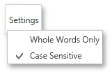

# Search Panel
The **Search** panel allows you to find specific text throughout a report document.

To invoke the **Search** panel, click the **Search** button  in the [Toolbar](preview-toolbar.md) or press CTRL+F.

In the search box on the left, input the text to find. Click the **Settings** button to invoke the dedicated submenu allowing you to specify whether or not to use case-sensitive search, and whether you are required to match the whole word during the search.

To start searching, or search down again, click **Next**, or press ENTER or CTRL+G. To search backward, click **Previous** or press CTRL+SHIFT+G.