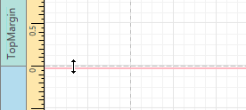

# Design Surface
The **Design Surface** displays a report that is currently being edited in the Report Designer.

The Design Surface includes the following principal elements.
* [Rulers](#rulers)
* [Band Captions](#bandcaptions)
* [Context Menus](#contextmenus)
* [In-place Editors](#inplaceeditors)

<a name="rulers"/>

## Rulers
The horizontal and vertical rulers display tickmarks in the [measurement units](../creating-reports/basic-operations/change-measurement-units-of-a-report.md) specified for a report. Click an element to evaluate its size and location using the rulers.

The vertical ruler also allows you to change the band height by moving its top and bottom sliders.

<a name="bandcaptions"/>

## Band Captions
In the Report Designer, each report band carries a caption, tab title and color, which depend on the band kind. These captions are not printed in the resulting report document and are only visible at design time.

To access band properties, select the band by clicking its caption, and then switch to the [Properties Panel](properties-panel.md).

<a name="contextmenus"/>

## Context Menus
The context menu provides quick access to the most commonly used actions that depend on the element for which it is invoked. For example, it allows you to insert new bands, cut/copy/paste/delete report controls, etc. For certain report controls, the context menu also includes the **Edit...** option, which invokes the dialog with complex settings (such as data binding settings, formatting, etc.) To invoke this menu, right-click a report element or the report editing surface.

<a name="inplaceeditors"/>

## In-place Editors
An in-place editor allows you to edit the content of a text-oriented control (Bar Code, Check Box, Label, Table Cell or Zip Code) by double-clicking it.

To learn how to use the in-place editor to supply dynamic data to a control, see [Using Mail Merge](../creating-reports/providing-data/using-mail-merge.md).