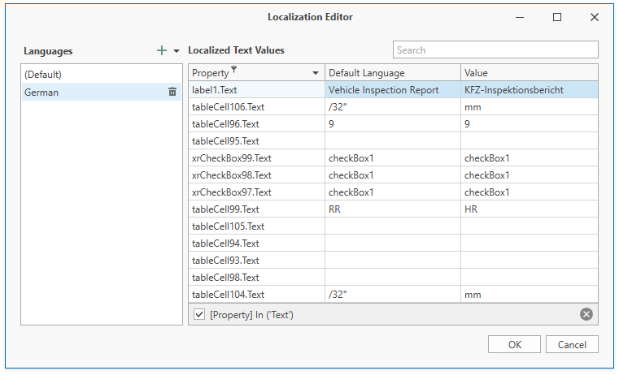
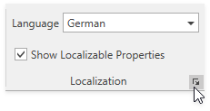
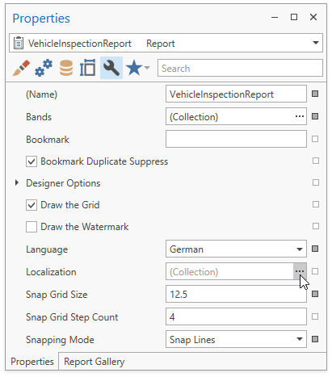

# Localization Editor

The Localization Editor allows you to change the text of the localizable textual properties for all the controls in a report.

The left panel allows you to change the report's language or add a new language to start localization.
The right panel contains a grid that displays the property name, the text specified for that property in the default language, and the text for the selected language. Text strings of the selected language are editable.

## Invoke the Localization Editor

Use one of the following actions:

* Switch to the **View** Toolbar tab. Click the **dialog box launcher** in the **Localization** group.

    

* Click the **Localization** property's ellipsis button in the [Properties Panel](properties-panel.md).

    

## Use the Localization Editor

* To add a new language, click the _plus_ button in the right panel. All values for the new language are set to the default language's values.

* Change the text and click the **OK** button to close the editor and apply your changes.

> [!Tip]
> When the Localization Editor is invoked, the grid in the right panel displays values for the report controls' **Text** properties. You can click the filter icon in the **Property** column header to modify a filter and select other properties or clear the filter to show all textual properties.
