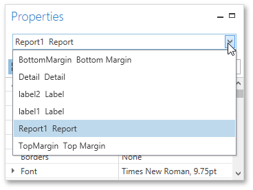
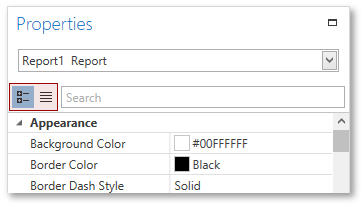
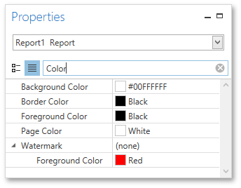

# Properties Panel
The **Properties** panel allows you to access and customize settings of a report and its [elements](../report-elements.md). 

This document describes different aspects of using the Properties panel and consists of the following sections.
* [Selecting a Report Element](#selectingelements)
* [Display Modes](#displaymodes)
* [Changing Property Values](#changingproperties)
* [Searching for Properties](#searching)

<a name="selectingelements"/>

## Selecting a Report Element
To select an element and show its properties in the Properties panel, do one of the following.
* Select a required element in the drop-down list at the top of the Properties panel.
	
	
* Click a required element in the [Report Design Surface](design-surface.md).
* Select a required element in the [Report Explorer](report-explorer.md).

<a name="displaymodes"/>

## Display Modes
The Properties panel can display element properties in alphabetical flat order or combine them into categories depending on their purposes. To switch between these display modes, use the dedicated buttons. 

<a name="changingproperties"/>

## Changing Property Values
In the Properties panel, each row consists of two cells: the header cell showing the property caption and the value cell. To set a property value, locate the property and specify its value using the corresponding cell editor. Specific properties contain nested properties, which can be accessed by clicking the expand button for the property captions.

<a name="searching"/>

## Searching for Properties
The Properties panel includes the search box that allows you to search for a required property. When you type within the search box, the Properties panel automatically creates a search criteria based on the entered text and filters the list of available properties.

If you type two substrings separated by the space character, these substrings are considered as individual conditions combined by the **OR** logical operator. To find properties that contain both substrings (i.e., to use the **AND** logical operator), type "+" before the second substring. Similarly, type "-" to exclude properties that contain a specific substring. To search for a property that contains a space character, enclose the entered string in quotation marks. You can also combine several logical operators and quotation marks.