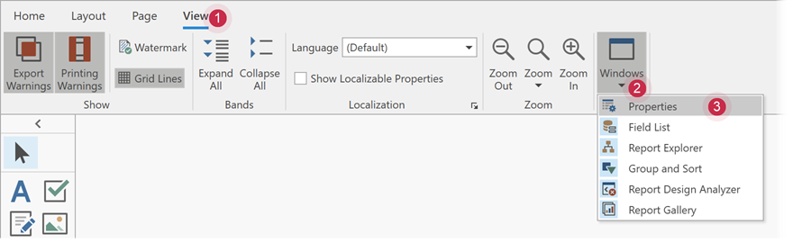
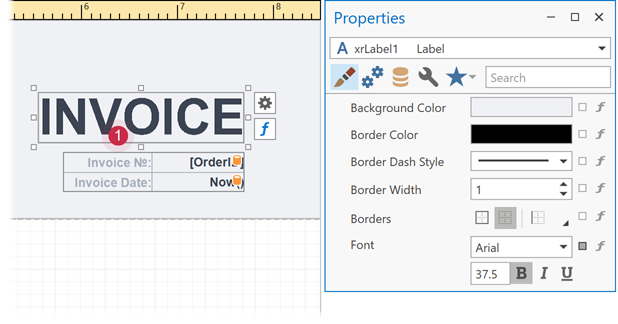
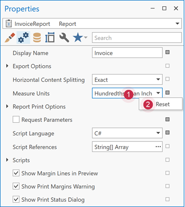
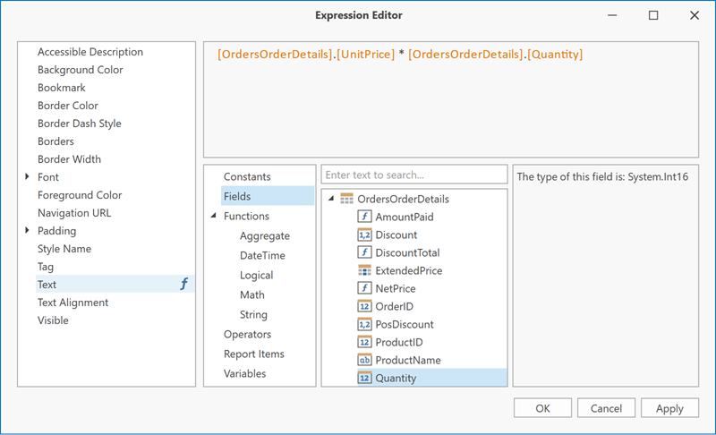

# Properties Window

Use the Properties window to view, discover, and change the properties of selected report [elements](../report-elements.md).

Switch to the **View** ribbon tab, expand the **Windows** group, and click **Properties** to show or hide the Properties window.

## Select a Report Element

Do one of the following to select a report element and show its properties in the Properties window:

* Select a report element from the drop-down list at the top of the Properties window.

	

* Click a report element on the [design surface](design-surface.md).

	

* Select a report element in the [Report Explorer](report-explorer.md).

	

## Category Tabs

The Properties window splits properties into category tabs and sorts them alphabetically.

## Favorite Properties

The Favorites tab contains the most used (or “favorite”) properties.

Use the **Favorite Properties Editor** to add properties to the Favorites tab. Click the **Edit Favorite Properties...** menu item to open the **Favorite Properties Editor** that lists the report controls. Check/uncheck properties to modify these controls’ favorite property lists.

## Change Property Values

A marker near each property indicates whether a property value differs from its default value.

Right-click a property’s editor to reset the value.

## Specify Expressions

The Properties window allows you to set expressions that specify property values. Click the `f` button to specify an expression in the invoked Expression Editor.

## Search for Properties

The integrated search box allows you to find properties. When you type within the search box, the Properties window filters the list and displays properties that match the entered text.

If you type two substrings separated by a space character, these substrings are considered as individual search criteria. The Properties window shows the properties that match either of these substrings. To find properties that contain both substrings, enclose the typed string in quotation marks or type "+" before the second substring (for instance, **foreground +color**).

Type "-" to exclude properties that contain a specific substring (for instance, **border -color**).
