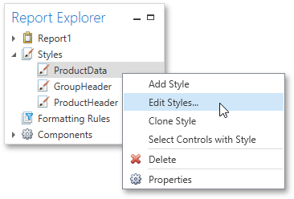

# Report Explorer
The **Report Explorer** reflects a report's structure in a tree-like form providing easy access to [report elements](../../../../../interface-elements-for-desktop/articles/report-designer/report-designer-for-wpf/report-elements.md). Additionally, the Report Explorer contains the **Components** node, which displays non-visual report components such as data objects created when [binding a report to a data source](../../../../../interface-elements-for-desktop/articles/report-designer/report-designer-for-wpf/creating-reports/providing-data/binding-a-report-to-data.md). You can also use the Report Explorer to manage [styles](../../../../../interface-elements-for-desktop/articles/report-designer/report-designer-for-wpf/creating-reports/appearance-customization/understanding-style-concepts.md) and [formatting rules](../../../../../interface-elements-for-desktop/articles/report-designer/report-designer-for-wpf/creating-reports/appearance-customization/conditionally-change-a-controls-appearance.md) available for a report.

To access and edit settings of a report element or component, select it in the Report Explorer and switch to the [Properties Panel](../../../../../interface-elements-for-desktop/articles/report-designer/report-designer-for-wpf/interface-elements/properties-panel.md). You can also right-click elements and components to invoke their context menu.

In the Report Explorer, data-aware controls are marked with a special database icon.

You can manage styles and formatting rules using commands available in context menus. To invoke a context menu, right-click the corresponding root node or its sub-node.

