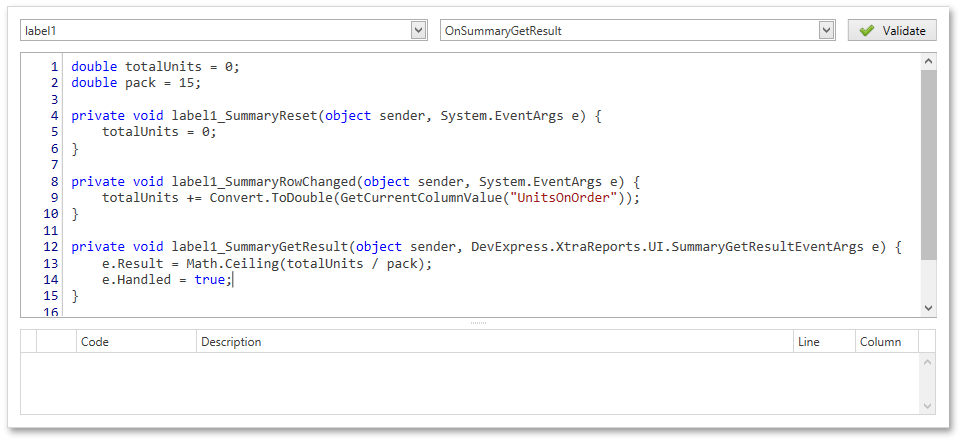

The **Script Editor** allows you to write code for specific event handlers in the [Report Designer](../../../../../interface-elements-for-desktop/articles/report-designer/report-designer-for-wpf.md) to adjust the behavior of [report controls](../../../../../interface-elements-for-desktop/articles/report-designer/report-designer-for-wpf/report-elements/report-controls.md), [bands](../../../../../interface-elements-for-desktop/articles/report-designer/report-designer-for-wpf/report-elements/report-bands.md) or the report itself.

This topic describes the basics of using scripts, the Script Editor interface and shows how to use scripting in a report. The document consists of the following sections.
* [Scripting Overview](#overview)
* [Maintaining Scripts](#maintaining)

<a name="overview"/>

## Scripting Overview
The Script Editor provides you with the capability to write and execute scripts at runtime when a report is generated. Scripting is made available to extend the standard functionality as far as may be required.

The Script Editor supports **C#** and **Visual Basic .NET** scripting languages. This means that the scripting language is independent from the language used to create the report. You can specify the language using the **Script Language** property. The selected scripting language should be the same for all scripts used in a report.

<a name="maintaining"/>

## Maintaining Scripts
Each report element has its own set of events, which are individual for each element type. To handle an event of a report element, do one of the following.
* Select the required report element (e.g., on the [Design Surface](../../../../../interface-elements-for-desktop/articles/report-designer/report-designer-for-wpf/interface-elements/design-surface.md)). In the [Properties Panel](../../../../../interface-elements-for-desktop/articles/report-designer/report-designer-for-wpf/interface-elements/properties-panel.md), expand the **Scripts** property and click the plus button for the event.
	
	
* Click the **Scripts** button () in the [Toolbar](../../../../../interface-elements-for-desktop/articles/report-designer/report-designer-for-wpf/interface-elements/toolbar.md) to display the Script Editor. Choose the required report element in the dedicated drop-down list at the left top of the Script Editor. Then, select one of the available events in another list at the right top.
	
	

After the event is specified, a code template is automatically generated in the current scripting language and added in the Script Editor.

To check for errors in the report's script, click the **Validate** button. The validation result is displayed in the errors panel at the bottom of the Script Editor. Double-click the error item in the panel's list to go to the corresponding line of code. If all scripts are valid, the errors panel is empty.

