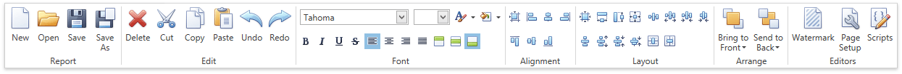

# Toolbar
The **Toolbar** allows you to easily perform various report commands, which are divided into the following sections.
* [Report Commands](#report)
* [Edit Commands](#edit)
* [Font Commands](#font)
* [Arrange Commands](#arrange)
* [Editors Commands](#editors)

<a name="report"/>

## Report Commands
Use these commands to save and load report layouts.

| Icon | Command | Description |
|---|---|---|
|  | New | [Creates a new report](../../../../../interface-elements-for-desktop/articles/report-designer/report-designer-for-wpf/creating-reports/basic-operations/create-a-new-report.md) using the [Report Wizard](../../../../../interface-elements-for-desktop/articles/report-designer/report-designer-for-wpf/report-wizard.md). |
|  | Open | Invokes the **Open** dialog that allows you to select the report layout [to be opened](../../../../../interface-elements-for-desktop/articles/report-designer/report-designer-for-wpf/creating-reports/basic-operations/back-up-the-report-layout.md). |
|  | Save | [Saves the current report](../../../../../interface-elements-for-desktop/articles/report-designer/report-designer-for-wpf/creating-reports/basic-operations/back-up-the-report-layout.md) to the default file. |
|  | Save as | Invokes the **Save** dialog that allows you to select a file to which the current report layout [should be saved](../../../../../interface-elements-for-desktop/articles/report-designer/report-designer-for-wpf/creating-reports/basic-operations/back-up-the-report-layout.md). |

<a name="edit"/>

## Edit Commands
Use the following commands to delete the selected report elements, place them to the clipboard, paste them onto report bands and cancel previous actions.   

| Icon | Command | Description |
|---|---|---|
|  | Delete | Deletes the selected report elements. |
|  | Cut | Cuts the selected report elements to the clipboard. |
|  | Copy | Copies the selected report elements to the clipboard. |
|  | Paste | Pastes the contents of the clipboard to the selected report band. |
|  | Undo | Cancels the last change made to the report. |
|  | Redo | Reverses the results of the last undo action. |

<a name="font"/>

## Font Commands
Use these commands to easily customize font, color, formatting and alignment settings. 

| Icon | Command(s) | Description |
|---|---|---|
|  | Font Name | Specifies the font name of the selected elements. |
|  | Font Size | Specifies the font size of the selected elements. |
|  | Foreground Color | Specifies the foreground color of the selected elements. |
|  | Background Color | Specifies the background color of the selected elements. |
|  | Bold, Italic, Underline, Strikeout | Applies/removes bold formatting, italic formatting, underlining and strike through to/from the selected elements. |
|  | Left, Center, Right, Justify | Specifies the horizontal text alignment of the selected elements. |
|  | Top, Center, Bottom | Specifies the vertical text alignment of the selected elements. |

<a name="arrange"/>

## Arrange Commands
These commands allow you to change the order of stacked elements.

| Icon | Command | Description |
|---|---|---|
|  | Bring to Front | Brings the selected elements to the front of a group of stacked elements or moves the selected elements one step closer to the front. |
|  | Send to Back | Sends the selected elements to the back of a group of stacked elements or moves the selected elements one step toward the back. |

<a name="editors"/>

## Editors Commands
Use the following commands to invoke the **Watermak** dialog, **Page Setup** dialog or **Script Editor**.

| Icon | Command | Description |
|---|---|---|
|  | Watermark | Invokes the [Watermark dialog](../../../../../interface-elements-for-desktop/articles/report-designer/report-designer-for-wpf/creating-reports/adding-details-about-a-report/create-or-modify-watermarks-of-a-report.md) that allows you to add a text watermark to a report or turn a picture into a report's background. |
|  | Page Setup | Invokes the [Page Setup dialog](../../../../../interface-elements-for-desktop/articles/report-designer/report-designer-for-wpf/creating-reports/basic-operations/adjust-page-layout-settings.md) that allows you to modify the paper size, orientation and margins. |
|  | Scripts | Shows or hides the [Script Editor](../../../../../interface-elements-for-desktop/articles/report-designer/report-designer-for-wpf/interface-elements/script-editor.md) that allows you to write code for specific event handlers. |