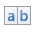

# Report Controls
In general, _report controls_ allow you to present information of different kinds (e.g., simple or formatted text, pictures, tables, etc.) in your static and [dynamic](../creating-reports/providing-data/binding-report-controls-to-data.md) reports, and to [adjust your report's layout](../creating-reports/basic-operations/adjust-the-layout-of-report-elements.md) (by organizing controls within panels, and inserting page breaks at the required positions).

The following table lists the available controls (in the same order as in the [Toolbox](../interface-elements/control-toolbox.md)).

| Icon | Description |
|---|---|
|  | The most basic **Label** control is intended to display static or dynamic text or both in your report. In addition, it can be used to [calculate standard summary functions](../creating-reports/shaping-data/calculating-summaries.md) across a data field. |
|  | The **Check Box** control is intended to display True/False or Checked/Unchecked/Indeterminate states in a report by displaying (or not) a check mark, which can be accompanied by a text description. |
|  | The **Rich Text** control allows you to display formatted text in your report. It can display static or dynamic text or both. You can also load content to the Rich Text from an external TXT or RTF file (which can contain images). |
|  | The **Picture Box** control is intended to display images of numerous formats in a report. An image can be loaded from an external file, from a [bound data source](../creating-reports/providing-data/binding-a-report-to-data.md), or from a web location using the specified URL. |
|  | The **Panel** control is a container that frames separate report controls to allow them to be easily moved, copied and pasted, and visually unite them in the [report's preview](../document-preview.md) (with borders or a uniform color background). |
|  | The **Table** control is designed to arrange information in a [tabular layout](../report-types/table-report.md). It may contain any number of **rows** comprised of individual **cells**. Both rows and cells can be selected and customized individually. In most aspects, a cell is similar to a Label, but can also contain other controls (e.g., Picture Box or Rich Text). |
|  | The **Character Comb** control displays text so that each character is printed in an individual cell. |
|  | The **Line** control draws a line of a specified direction, style, width and color. It can be used for both decoration and visual separation of report sections. The Line cannot cross [report bands](report-bands.md), as opposed to the Cross-band Line control. |
|  | The **Shape** control allows you to embed simple graphic objects into your report. You can choose one of the multiple predefined shapes (e.g., rectangles, ellipses, arrows, polygons, crosses and brackets of various kinds). |
|  | The **Bar Code** control transforms its content into a bar code of the specified type. Multiple standard bar code types are supported. |
|  | The **Zip Code** control renders a numeric postal code that is used to identify the mail address in some countries. This control is not related to the Zone Improvement Plan (ZIP) code used by the United States Postal Service. |
|  | The **Chart** is a sophisticated control used to embed graphs into your report. It graphically represents a series of points using numerous 2D or 3D chart types. A Chart can be populated with points both manually (by specifying arguments and values for each point) and dynamically (by connecting it to the [report's data source](../creating-reports/providing-data/binding-a-report-to-data.md) or binding it to a separate one). See [Chart with Static Series](../report-types/chart-with-static-series.md) and [Chart with Dynamic Series](../report-types/chart-with-dynamic-series.md) for more information. |
|  | The **Gauge** control provides you with the capability to embed graphic gauges into your report. |
|  | The **Sparkline** control displays a compact chart that is commonly used to reflect the flow of data for every row in a report. |
|  | The **Pivot Grid** control represents dynamic data (obtained from an underlying [data source](../creating-reports/providing-data/binding-a-report-to-data.md)) in a cross-tabulated form to create [cross-tab reports](../report-types/cross-tab-report.md), similar to Pivot Tables in Microsoft Excel&#174;. Column headers display unique values from one data field, and row headers - from another field. Each cell displays a summary for the corresponding row and column values. By specifying different data fields, you can see different totals. This allows you to get a compact layout for a complex data analysis. |
|  | The **Subreport** control allows you to include other reports in your current report. To learn more, see [Master-Detail Report (Subreports)](../report-types/master-detail-report-(subreports).md). |
|  | The **Table Of Contents** control generates a [table of contents](../creating-reports/report-navigation-and-interactivity/create-a-table-of-contents.md) based on [bookmarks](../creating-reports/report-navigation-and-interactivity/add-bookmarks.md) specified for report elements. |
|  | The **Page Info** control is intended to [add page numbers and system information to a report](../creating-reports/adding-details-about-a-report/add-page-numbers-and-system-information-to-a-report.md) (the current date and time or the current user name) into your report. As with many other controls, you can format this control's content. |
|  | The **Page Break** control's sole purpose is to insert a page delimiter at any point within a report. |
|  | The **Cross-band Line** control allows you to draw a line through several [report bands](report-bands.md). This can be useful if you need to visually emphasize a section consisting of multiple band areas. In other aspects, it is similar to a regular Line. |
|  | The **Cross-band Box** control allows you to draw a rectangle through several [report bands](report-bands.md). This can be useful if you need to visually encompass a section consisting of multiple band areas. |

To learn how to create report controls and change their layout, refer to [Create and Delete Report Elements](../creating-reports/basic-operations/create-and-delete-report-elements.md) and [Adjust the Layout of Report Elements](../creating-reports/basic-operations/adjust-the-layout-of-report-elements.md).