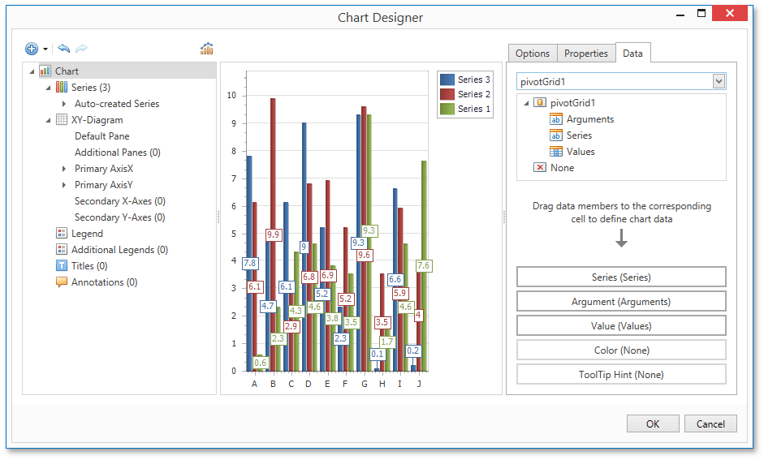
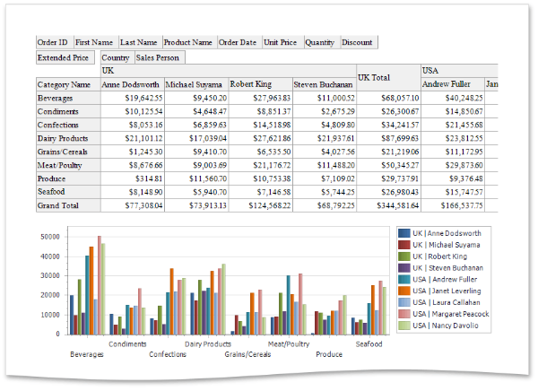

# Cross-Tab Report
This tutorial describes the steps needed to create a _cross-tab report_ using the [Pivot Grid](../report-elements/report-controls.md) control. This feature should not be confused with the [master-detail report](master-detail-report.md) or [table report](table-report.md). Additionally, the document demonstrates how to visualize data displayed in the Pivot Grid by linking it with the [Chart](../report-elements/report-controls.md) control.

## Create a Cross-Tab Report
To create a cross-tab report, do the following.
1. [Create a new empty report](../creating-reports/basic-operations/create-a-new-report.md).
2. Drop the [Pivot Grid](../report-elements/report-controls.md) control from the [Toolbox](../interface-elements/control-toolbox.md) onto the report's [Detail band](../report-elements/report-bands.md).
	
	
3. To bind the Pivot Grid to a data source, right-click it and select **Edit...** in the context menu. In the invoked dialog, expand the **Data Source** drop-down and click the **Add New** button.
	
	
4. The invoked **Data Source Wizard** will guide you through the process of assigning a data source to the grid. For detailed instructions on the Wizard's steps, refer to [Binding a Report to Data](../creating-reports/providing-data/binding-a-report-to-data.md), as this process is similar.
	
	After the data source is created, it is assigned to the pivot grid's **Data Source** property. Its **Data Member** property defines from which table or view of the data source the grid obtains its data.
	
	
	
	> [!NOTE]
	> Since you have placed a Pivot Grid in the Detail band, the report's **Data Source** property should not be set. Otherwise, the Pivot Grid will be repeated at the preview as many times as there are records in the data source.
	> 
	> 
5. Once again, right-click the Pivot Grid and select **Run Designer...** in the invoked context menu.
	
	
6. In the invoked **PivotGrid Designer**, click **Retrieve Fields**.
	
	
7. Then, switch to the **Layout** section in the navigation bar on the left.
	
	Drag and drop the required fields to the **Row Fields**, **Column Fields** and **Data Items** areas.
	
	
	
	Click **Apply** and close the editor.
8. In the last step, you can set your report's **Vertical Content Splitting** option to **Smart**. This will split the grid's columns precisely by their borders in the Print Preview.
	
	

The cross-tab report is now ready. Switch to the [Print Preview](../document-preview.md) tab and view the result.

## Integrate with a Chart Control
The next step is to visualize data displayed in the Pivot Grid using a Chart control. To accomplish this, perform the following steps.
1. Drop the [Chart](../report-elements/report-controls.md) control from the [Toolbox](../interface-elements/control-toolbox.md) onto the report's [Detail band](../report-elements/report-bands.md) below the Pivot Grid. After you drop the Chart, the **Chart Designer** is automatically invoked.
2. In the Designer, remove an already existing series by clicking the corresponding button.
	
	
3. Then, go to the **Data** tab at the right of the Designer's window and choose the Pivot Grid in the dedicated drop-down list.
	
	
4. After this, all the Chart's binding and layout settings are automatically adjusted. Make sure that **Series**, **Argument** and **Value** cells have been automatically filled with the corresponding fields. Note, values for these fields are generated based on the Pivot Grid's columns, rows and data items, respectively.
	
	
5. To avoid the overlapping of series labels, select the auto-generated series in the chart elements tree, and in the **Options** tab, disable the **Labels Visibility** check box.
	
	
6. If required, you can customize various settings that determine the common behavior for a bridged Chart and Pivot Grid pair. To do this, use the Chart's **Pivot Grid Data Source Options** property. This property, in turn, is linked to the **Options Chart Data Source** property of the associated Pivot Grid.
7. Finally, reset the report's **Vertical Content Splitting** option and switch to the [Preview Tab](../../report-designer-for-winforms/report-designer-reference/report-designer-ui/preview-tab.md) to see the result.
	
	