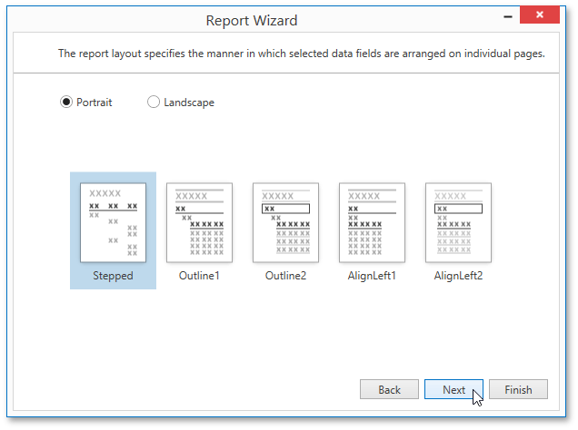

# Choose a Report Layout
This page allows you to specify the layout of elements in your report. If you haven't applied data grouping, you can specify how data field values are arranged - into a table, one under another, etc. If report data is grouped, you can choose one of the available indentation styles for nested elements.

Additionally, this page allows you to specify the page orientation for your report.

The following options are available if data grouping has been applied.

If data hasn't been grouped, you will see the following report layout options.

You can stop the wizard at this step by clicking **Finish**. If you want to customize your report further, click **Next** to proceed to the next wizard page: [Choose a Report Style](choose-a-report-style.md).