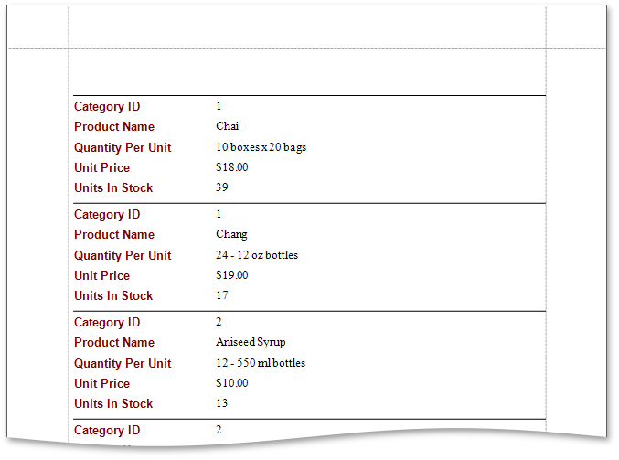

# Choose Columns to Display in a Report
This wizard page allows you to select fields (attributes) whose data will be displayed in a report.

The list on the left-hand side shows all available fields (attributes). To select the required fields to be displayed in the report, move them to the right-hand side. Use the dedicated arrow buttons to move fields back and forth.

The selected fields and corresponding captions will be automatically added to your report and arranged one under another.

You can stop the wizard at this step by clicking **Finish**. In this case, the report will look similar to the image below.

If you want to customize your report further, click **Next** to proceed to the next wizard page: [Add Groping Levels](add-groping-levels.md). Note that you should select at least one field to continue creating the report.