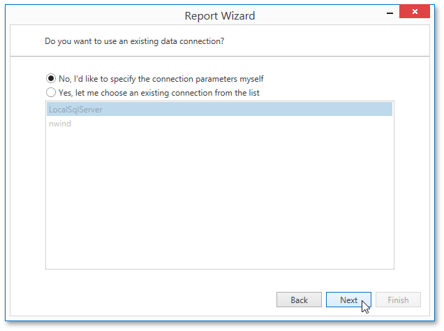

# Select a Data Connection
On this page, you can choose whether to use one of the existing data connections or create a new one.

Click **Next** to proceed to the next wizard page. If you select one of the available connections from the list, go to the [Customize the Query](../../../../../../../interface-elements-for-desktop/articles/report-designer/report-designer-for-wpf/report-wizard/data-bound-report/connect-to-a-database/customize-the-query.md) page. Otherwise, proceed to the [Specify a Connection String](../../../../../../../interface-elements-for-desktop/articles/report-designer/report-designer-for-wpf/report-wizard/data-bound-report/connect-to-a-database/specify-a-connection-string.md) page to create a custom connection string and manually specify its parameters.