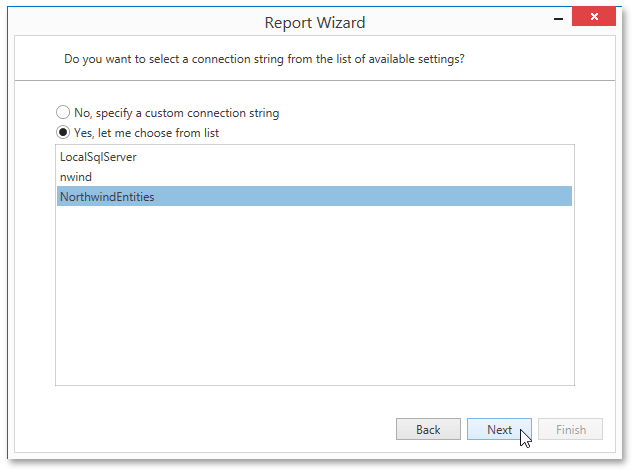

# Select the Connection String
This page allows you to specify a connection string to be used to establish a data connection.

The following two options are available.
* **No, specify a custom connection string** - Select this option to specify a connection string manually.
* **Yes, let me choose from the list** - Select this option to use one of the existing connection strings from the list.

Click **Next** to proceed to the next wizard page. If you select the first option, proceed to the [Specify a Connection String](specify-a-connection-string.md) page. If you choose one of the available connection strings, go to the [Bind to a Stored Procedure](bind-to-a-stored-procedure.md) or [Select a Data Member](select-a-data-member.md) page, depending on whether or not the current Entity Framework model provides stored procedures.