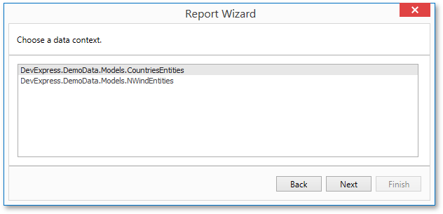

# Select the Data Context
This page allows you to select a required Entity Framework data context that will provide data to a report.

On this page, select a data context from the list of existing data contexts. You can also populate this list with data contexts from a separate assembly. To do this, click **Browse...**, and in the invoked **Open** dialog, select the required assembly.

Click **Next** to proceed to the next wizard page: [Select the Connection String](../../../../../../../interface-elements-for-desktop/articles/report-designer/report-designer-for-wpf/report-wizard/data-bound-report/connect-to-an-entity-framework-data-source/select-the-connection-string.md).