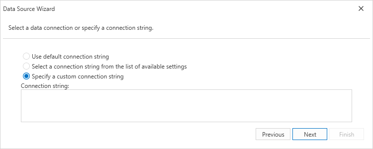

# Specify a Connection String
On this wizard page, specify a connection string. Additionally, this page requires you to specify whether or not to store the connection string in the application configuration file.

Click **Next** to proceed to the next wizard page. If the current Entity Framework model provides stored procedures, go to the [Bind to a Stored Procedure](bind-to-a-stored-procedure.md) page; otherwise, proceed to the [Select a Data Member](select-a-data-member.md) page.