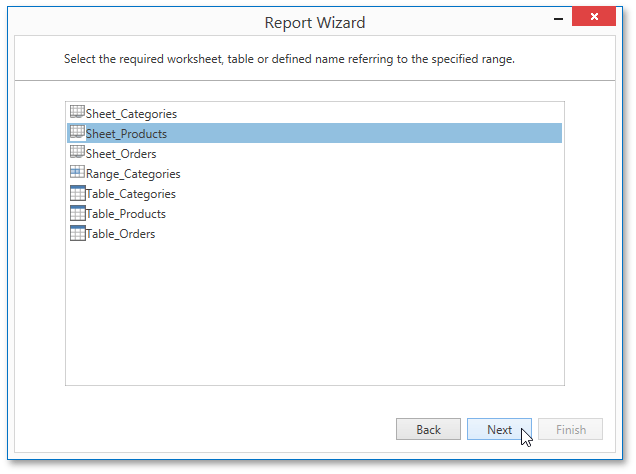

# Select a Worksheet, Table or Named Region
> [!NOTE]
> This wizard page appears only if you selected a Microsoft Excel Workbook on the previous page.

This wizard page allows you to select one of the available worksheets, tables or named regions that will provide data for a report.

Click **Next** to proceed to the next wizard page: [Choose columns](choose-columns.md).