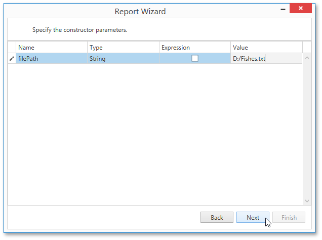

# Specify the Constructor Parameters
On this wizard page, you can specify the constructor parameters.

To specify the constructor parameter's value, use the **Value** column. Enable the check box in the **Expression** column to make it possible to specify the parameter expression using the **Expression Editor**. In this case, you can pass an existing report parameter to the constructor or create a new one using the in-place editor.

Click **Next** to proceed to the next wizard page: [Choose Columns to Display in a Report](../choose-columns-to-display-in-a-report.md).