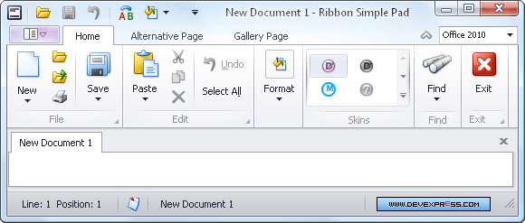

# Ribbon
The Ribbon organizes commands into a tabbed interface, providing quick and intuitive access to these commands.

&nbsp;

Topics in this section:
* [Frequently Used Ribbon Commands](ribbon/frequently-used-ribbon-commands.md)
* [Minimize Ribbon](ribbon/minimize-ribbon.md)
* [Invoke Ribbon Commands](ribbon/invoke-ribbon-commands.md)