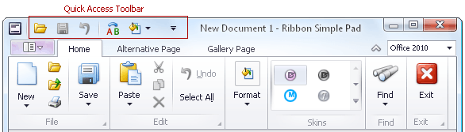
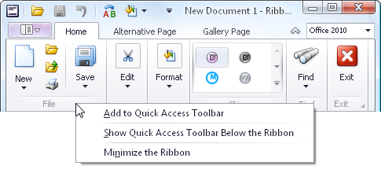
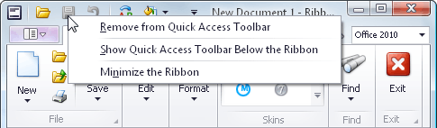

# Frequently Used Ribbon Commands
Frequently used commands are typically displayed within the Quick Access Toolbar, at the top of the Ribbon:

To add any command to the Quick Access Toolbar, right-click the command and select **Add to Quick Access Toolbar**:

To add a group of commands to the Quick Access Toolbar, right-click the group's caption and select **Add to Quick Access Toolbar**:

To remove any command from the Quick Access Toolbar, right-click the command and select **Remove from Quick Access Toolbar**:

