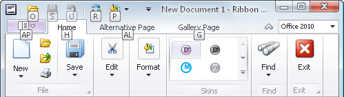

# Invoke Ribbon Commands
To select a specific command, you can click it with the mouse or invoke it via its shortcut. See below for more information.

Shortcuts are associated with each page and command in the Ribbon. To see the shortcuts, press ALT or F10. Shortcuts will appear next to the corresponding tab pages and commands:

Shortcuts can be composed of one, two or three symbols. 
If a shortcut is represented by one symbol, you can invoke the command by pressing this symbol. 
If a shortcut is represented by two or three symbols, to invoke the command, press the symbols one after another.

Initially, when pressing ALT or F10, shortcuts are displayed for commands within the Quick Access Toolbar (at the top of the Ribbon) and for tab pages.
To access shortcuts for commands within a specific tab page, you need to press the shortcut associated with this page.

For example, to display shortcuts for commands within the Home page (see the image above), press **H**:

